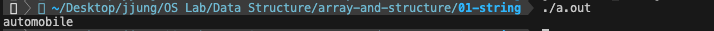
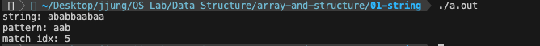

# 2-1 문자열

C언어에서는 문자열을 위한 기본 데이터 타입이 존재하지 않는다. 대신 배열의 원소가 문자인 데이터 타입을 문자열이라고 칭하며, 해당 배열은 항상 `널문자('\0')`로 끝난다.

```c
#include <string.h>

char str1[] = {"dog"};
char str2[] = "cat";
char str3[] = {'r', 'a', 'b', 'b', 'i', 't'};

char *str4 = "monkey";

char str5[10];
strcpy(str5, "bear");
```

<br><br>

### 문자열 관련 함수

문자열과 관련된 함수는 [string.h](https://www.ibm.com/docs/ko/ssw_ibm_i_75/rtref/stringh.htm) 헤더파일에 정의되어 있다.

- [[source] 문자열의 특정 위치에 다른 문자열 삽입하기](./insert_string.c)  

    

- [[source] 특정한 패턴을 보이는 문자열의 위치 반환하기](./match_string.c)

    