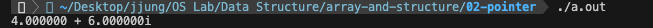

# 2-2 포인터

```c
#include <stdio.h>

int main()
{
    int a, b, *p;

    a = 10;
    p = &a; // a의 주소를 p에 저장(= p는 a를 가리킴)
    b = *p; // p가 가리키는 곳에 저장된 값을 b에 저장
    *p = 20;

    printf("a = %d, b = %d\n", a, b); // a = 20, b = 10

    return 0;
}
``` 

- `주소 연산자(&)`: 변수의 주소
- `간접 연산자(*)`: 포인터 변수가 가리키는 곳에 저장된 값

<br><br>

### 래기드(Ragged) 배열

래기드 배열이란 **각 행마다 다른 길이의 열을 가지는 2차원 배열**로, 주로 문자열을 저장하는 데 유용하게 사용된다. 특히 배열에 저장하고자 하는 문자열의 크기가 각기 다를 때 저장 공간 낭비를 방지할 수 있다.

```c
// 래기드 배열 선언 및 초기화
char *p[2][3] = {"abc", "defg", "hi", "jklmno", "pqrstuvw", "xyz"};
char *p[2][] = {
        {"abc", "defg", "hi"},
        {"jklmno", "pqrstuvw", "xyz"}
    };
```

- `***p`: 'a'
- `**p[1]`: 'j'
- `**(p[1] + 2)`: 'k' 
- `*(*(p + 1) + 1)[7]`: error ([]가 *보다 우선순위가 높음)
    - `*(*(p + 1) + 1)[0]`: 'p'
    - `*(*(p + 1) + 1)[1]`: 'x'
- `(*(*(p + 1) + 1))[7]`: 'w'
- `*(p[1][2] + 2)`: 'z'

<br><br>

### 포인터와 구조체

`구조체 포인터`란, 구조체 변수의 주소를 갖는 변수를 말한다. 구조체 포인터의 멤버에 접근하기 위해서는 `->` 연산자를 이용한다.

```c
struct student{
    int id;
    char name[10];
}

struct student s, *p;
p = &a;
```

- `p->id`: `s.id`에 접근
- `p->name`: `s.name`에 접근

<br>

[[source] 복소수 덧셈 연산](./complex_addition.c)

