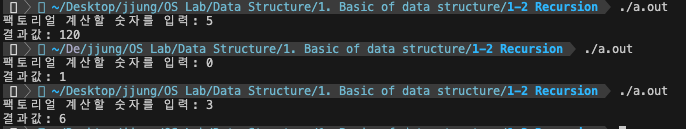
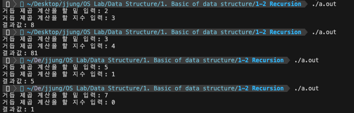
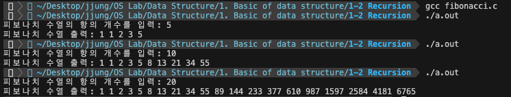

# 1-2 재귀 (Recursion)

재귀는 알고리즘이나 함수가 **자기 자신을 다시 호출**하여 문제를 해결하는 기법으로, 이를 통해 코드의 길이를 줄이고 읽고 쓰기 쉽게 프로그램을 작성할 수 있다. 재귀 함수에는 다음과 같은 부분이 필수적으로 포함되어야 한다.

- 기본 입력: 재귀 호출을 하는 부분
- 재귀 입력: 재귀 호출을 멈추는 부분

만약 재귀 호출을 멈추는 부분을 잘못 처리한다면, 종료되지 않는 무한 재귀가 발생할 수 있다.   

### 재귀와 반복

재귀는 재귀 호출을 사용하여 문제를 해결하고, 반복은 반복문을 사용하여 문제를 해결한다. 어떠한 방법이 성능이 더 좋다고 말할 수 없으며, 각각 특정 상황에 따라 재귀의 성능이 좋기도 반복의 성능이 좋기도 한다.

- 재귀(Recursion)
    - 자기 자신을 호출할 때마다 문제를 작은 부분으로 분할하여 해결 (Divide & Conquer)
    - 함수를 호출하고 그 함수 내에서 다시 자기 자신을 호출하는 형태
        - 재귀 호출을 종료하는 부분이 필수적으로 구현
        - 종료 조건이 만족될 때까지 자기 자신 호출
    - 코드의 길이가 줄고 가독성이 좋아질 수 있음
    - 순환적인 문제에 적합한 방법임  
    ex. 피보나치 수열, 팩토리얼, 거듭 제곱, 하노이탑, ...
    - 시간 복잡도
        - 재귀 호출이 몇 번 수행되는지에 따라 달라짐
        - 모든 것이 상수(함수 호출도 O(1))이고 재귀 호출이 n번 수행되면 O(n)
    - 공간 복잡도
        - 반복보다 높아질 수 있음
        - 재귀 호출이 발생할 때마다 함수 호출의 오버헤드 발생됨
        - 스택 프레임의 세그멘테이션 오류 발생할 수도 있음 (∵ stack 구조로 함수 호출)  
        cf. GDB 디버거를 통해 스택 프레임의 세그멘테이션 오류를 찾을 수 있음

- 반복(Iteration)
    - 반복문을 사용하여 동일한 작업을 반복적으로 수행
    - 명시적인 반복 횟수가 주어진 경우에 유용
    - 시간 복잡도
        - 반복 횟수에 따라 달라짐
    - 공간 복잡도
        - 재귀보다 낮을 수 있음
        - 일반적으로 단일 스택 프레임 내에서 작업 수행

 

반복을 통해 재귀와 동일한 작업을 수행할 수 있고, 시간 및 공간 복잡도는 반복이 더 좋은 경우가 많음에도 불구하고 재귀를 사용하는 이유는 다음과 같다.

1. 재귀를 사용하면 프로그램의 가독성이 좋아짐
2. 재귀는 복잡한 문제를 작은 문제로 분할하여 해결할 수 있음
3. 특히 순환적인 문제에서 반복보다 더 자연스러운 해결방법이 될 수 있음
4. 최근 컴퓨터 시스템의 성능 향상 덕분에 재귀의 효율성이 증가함

그러나 재귀가 항상 성능적으로 우수한 것이 아니기 때문에, 문제에 따라 적절한 구현 방식을 선택해야 한다.   

### 재귀 호출 예제

> 팩토리얼

$$n! = n \times (n - 1) \times (n - 2) \times \dots \times 1$$

[source](./factorial.c)

- 입력 받은 값(n)의 팩토리얼(n!) 계산 결과 출력하기
- 일반적으로 팩토리얼은 0 이상의 정수에 대해서만 정의함
- $0! = 1$: 일반적으로 0 팩토리얼은 1이라고 정의함

    

 

> 거듭 제곱

$$a^n = a \times a \times \dots \times a$$

[source](./exponentiation.c)

- 밑(base)과 지수(exp)를 입력받아 거듭제곱 계산 결과 출력하기
- $a^0 = 1$: 어떤 수를 0 제곱하면 항상 1이 됨

    

 

> 피보나치 수열

피보나치 수열은 첫 번째와 두 번째 항이 1이며, 그 뒤의 모든 항은 바로 앞의 두 항의 합으로 이루어진 수열이다. 이 수열의 요소들은 1, 1, 2, 3, 5, 8, 13, ... 순으로 생성된다.

$$F_n = F_{n-1} + F_{n-2} \\ F_1 = F_2 = 1, \quad F_0 = 0$$

[source1](./fibonacci_1.c)

[source2](./fibonacci_2.c)

- 피보나치 수열의 항의 개수(n)를 입력받아 해당 수열 출력하기
- 이 때, 항의 개수는 1개 이상이라고 가정
- 수열의 첫번째 항부터 출력 (0번째 항의 값은 0)

    

 

> 하노이 탑

[source](./hanoi_tower.c)

- 하노이 탑의 원판 개수(n)를 입력받아 하노이 탑 문제 해결과정 출력하기
- 각각의 값들은 원판의 크기를 나타냄
    - 값이 클 수록 원판의 크기가 큼
    - ex. 1보다 3이 더 큰 원판이므로, 3은 1 위로 올라갈 수 없음
- 원판이 없는 상태이면 값은 0

 
