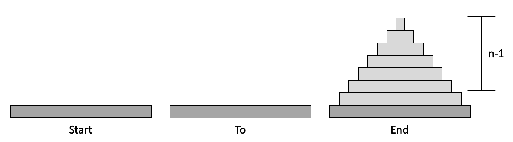

# 1-2 재귀 (Recursion)

재귀는 알고리즘이나 함수가 **자기 자신을 다시 호출**하여 문제를 해결하는 기법으로, 이를 통해 코드의 길이를 줄이고 읽고 쓰기 쉽게 프로그램을 작성할 수 있다. 재귀 함수에는 다음과 같은 부분이 필수적으로 포함되어야 한다.

- 기본 입력: 재귀 호출을 하는 부분
- 재귀 입력: 재귀 호출을 멈추는 부분

만약 재귀 호출을 멈추는 부분을 잘못 처리한다면, 종료되지 않는 무한 재귀가 발생할 수 있다. <br><br>

### 재귀와 반복

재귀는 재귀 호출을 사용하여 문제를 해결하고, 반복은 반복문을 사용하여 문제를 해결한다. 어떠한 방법이 성능이 더 좋다고 말할 수 없으며, 각각 특정 상황에 따라 재귀의 성능이 좋기도 반복의 성능이 좋기도 한다.

- 재귀(Recursion)
    - 자기 자신을 호출할 때마다 문제를 작은 부분으로 분할하여 해결 (Divide & Conquer)
    - 함수를 호출하고 그 함수 내에서 다시 자기 자신을 호출하는 형태
        - 재귀 호출을 종료하는 부분이 필수적으로 구현
        - 종료 조건이 만족될 때까지 자기 자신 호출
    - 코드의 길이가 줄고 가독성이 좋아질 수 있음
    - 순환적인 문제에 적합한 방법임  
    ex. 피보나치 수열, 팩토리얼, 거듭 제곱, 하노이탑, ...
    - 시간 복잡도
        - 재귀 호출이 몇 번 수행되는지에 따라 달라짐
        - 모든 것이 상수(함수 호출도 O(1))이고 재귀 호출이 n번 수행되면 O(n)
    - 공간 복잡도
        - 반복보다 높아질 수 있음
        - 재귀 호출이 발생할 때마다 함수 호출의 오버헤드 발생됨
        - 스택 프레임의 세그멘테이션 오류 발생할 수도 있음 (∵ stack 구조로 함수 호출)  
        cf. GDB 디버거를 통해 스택 프레임의 세그멘테이션 오류를 찾을 수 있음

- 반복(Iteration)
    - 반복문을 사용하여 동일한 작업을 반복적으로 수행
    - 명시적인 반복 횟수가 주어진 경우에 유용
    - 시간 복잡도
        - 반복 횟수에 따라 달라짐
    - 공간 복잡도
        - 재귀보다 낮을 수 있음
        - 일반적으로 단일 스택 프레임 내에서 작업 수행

<br>

반복을 통해 재귀와 동일한 작업을 수행할 수 있고, 시간 및 공간 복잡도는 반복이 더 좋은 경우가 많음에도 불구하고 재귀를 사용하는 이유는 다음과 같다.

1. 재귀를 사용하면 프로그램의 가독성이 좋아짐
2. 재귀는 복잡한 문제를 작은 문제로 분할하여 해결할 수 있음
3. 특히 순환적인 문제에서 반복보다 더 자연스러운 해결방법이 될 수 있음
4. 최근 컴퓨터 시스템의 성능 향상 덕분에 재귀의 효율성이 증가함


그러나 재귀가 항상 성능적으로 우수한 것이 아니기 때문에, 문제에 따라 적절한 구현 방식을 선택해야 한다. <br><br>

### 재귀 호출 예제

- [팩토리얼 (factorial)](#팩토리얼-factorial)
- [거듭 제곱 (exponentiation)](#거듭-제곱-exponentiation)
- [피보나치(fibonacci) 수열](#하노이-탑-hanoi-tower)
- [힐베르트(힐버트, Hilbert) 곡선](#힐베르트힐버트-hilbert-곡선)
- [기타 예제](#기타-예제)

<br>

#### *팩토리얼 (factorial)*


$$n! = n \times (n - 1) \times (n - 2) \times \dots \times 1$$


[source](./factorial.c)

- 입력 받은 값(n)의 팩토리얼(n!) 계산 결과 출력하기
- 일반적으로 팩토리얼은 0 이상의 정수에 대해서만 정의함
- $0! = 1$: 일반적으로 0 팩토리얼은 1이라고 정의함

    

<br>

#### *거듭 제곱 (exponentiation)*

$$a^n = a \times a \times \dots \times a$$

[source](./exponentiation.c)

- 밑(base)과 지수(exp)를 입력받아 거듭제곱 계산 결과 출력하기
- $a^0 = 1$: 어떤 수를 0 제곱하면 항상 1이 됨

    

<br>

#### *피보나치(fibonacci) 수열*

피보나치 수열은 첫 번째와 두 번째 항이 1이며, 그 뒤의 모든 항은 바로 앞의 두 항의 합으로 이루어진 수열이다. 이 수열의 요소들은 1, 1, 2, 3, 5, 8, 13, ... 순으로 생성된다.

$$F_n = F_{n-1} + F_{n-2} \newline F_1 = F_2 = 1, \quad F_0 = 0$$

[source1](./fibonacci_1.c)  
[source2](./fibonacci_2.c)

- 피보나치 수열의 항의 개수(n)를 입력받아 해당 수열 출력하기
- 이 때, 항의 개수는 1개 이상이라고 가정
- 수열의 첫번째 항부터 출력 (0번째 항의 값은 0)

    

<br>

#### *하노이 탑 (Hanoi tower)*

```
- 3개의 기둥이 존재하고, 처음에는 모든 원판이 첫 번째 기둥에 크기 순으로 쌓여있음
- 최소한의 움직임으로 모든 원판을 세 번째 기둥으로 이동시켜야함
- 한 번에 하나의 원판만 옮길 수 있음
- 작은 원판 위에 큰 원판을 올릴 수 없음
```

- 하노이 탑의 원판 개수(n)를 입력받아 하노이 탑 문제 해결과정 출력하기
- 코드 기본 정보

    

    - 하노이 탑의 세 개의 기둥을 **tower 변수에 저장하고, 각 기둥의 크기를 입력 받은 원판의 개수(n)만큼 동적 할당

        - tower[i][0]: 기둥 내에 위치한 원판 중 가장 맨 위에 있는 원판 값을 저장한 인덱스
        - *tower[0]: 첫번째 기둥, 초기 상태에 모든 원판이 위치한 기둥
        - *tower[1]: 두번째 기둥, 가운데에 위치한 기둥
        - *tower[2]: 세번째 기둥, 최종 상태에 모든 원판이 위치한 기둥  

    

    - 하노이탑 초기 상태

        - **tower 내 모든 값은 원판의 크기를 나타냄 (값이 클수록 원판의 크기가 큼)
        - 값이 0이라면 해당 층에는 원판이 없는 상태
        - tower[0][0]은 첫번째 기둥에 위치한 원판 중 가장 위에 있는 원판의 인덱스인 N
        - tower[1][0]과 tower[2][0]은 두번째, 세번째 기둥 내에 원판이 없으므로 0

    

    - 하노이탑 최종 상태

        - 세번째 기둥(*tower[2])에 모든 원판이 이동한 상태

[source1](./hanoi_tower.c)

- 직접 하노이 탑의 규칙을 세분화하여 작성한 코드
- 형태만 재귀일뿐 실제로 재귀의 장점을 하나도 활용하지 못함
    
    

[source2](./hanoi_tower2.c)

- 재귀의 장점을 살린 코드
- 큰 문제를 작은 문제로 세분화하여 해결
    ```
    1. n-1개의 원판을 경유지인 End를 활용하여 Start에서 To로 이동
    2. 가장 큰 원판을 한 번에 Start에서 End로 이동
    3. n-1개의 원판을 경유지인 Start를 활용하여 To에서 End로 이동
    ```

    $원판의 이동 횟수 = (2^{n-1} - 1) + 1 + (2^{n-1} - 1) = 2^n - 1$

    - 초기 상태

        

    - 1단계
    
        
    
    - 2단계

        

    - 3단계

        

- ex. 원판의 개수(n)가 4개일 때

    - 초기 상태

        

    - 네 번째 원판을 가장 큰 원판으로 보았을 때 (n)

        

        - 출발지 = A
        - 경유지 = B
        - 도착치 = C

    - 세 번째 원판을 가장 큰 원판으로 보았을 때 (n - 1)

        

        - 출발지 = B
        - 경유지 = A
        - 도착치 = C

    - 두 번째 원판을 가장 큰 원판으로 보았을 때 (n - 2)

        

        - 출발지 = A
        - 경유지 = B
        - 도착치 = C

    - 첫 번째 원판을 가장 큰 원판으로 보았을 때 (n - 3)

        

        - 출발지 = A
        - 도착치 = C

- 실행 결과

    
  
<br>

#### *힐베르트(힐버트, Hilbert) 곡선*

<br>

#### *기타 예제*

1. 주어진 숫자 n에 대해 첫비트부터 n비트까지의 합과 n+1비트부터 마지막 비트까지의 합이 동일한 이진 시퀀스를 찾아라. (이 때, 이진 시퀀스의 길이는 모두 2n이다.)

    ```
    Input: N = 2
    Output:
    0101 1111 1001 0110 0000 1010

    Input: N = 3
    Output:
    011011 001001 011101 010001 101011 111111
    110011 101101 100001 110101 001010 011110
    010010 001100 000000 010100 101110 100010
    110110 100100
    ```

    - [source](./practice1.c)
        
        - 입력 받은 값(n)과 동일한 크기의 배열(front, back)을 두 개 생성
        - front와 back 내의 합이 동일하면 두 개의 배열 출력
        - 0번째 인덱스부터 값을 채워나가면서 각각의 배열 내의 합 비교
        - 경우의 수는 모두 0이 채워지는 경우, 1이 채워지는 경우, 0과 1이 채워지는 경우, 1과 0이 채워지는 경우로 총 4가지
        - n = 2 일때

            

    - 실행 결과

        
