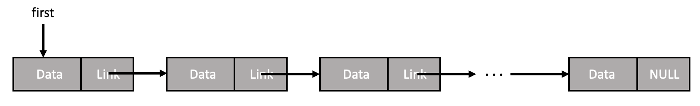
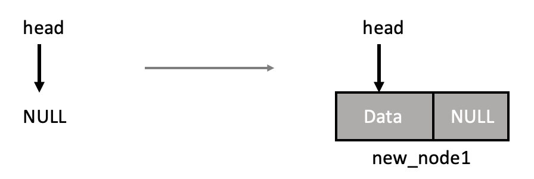
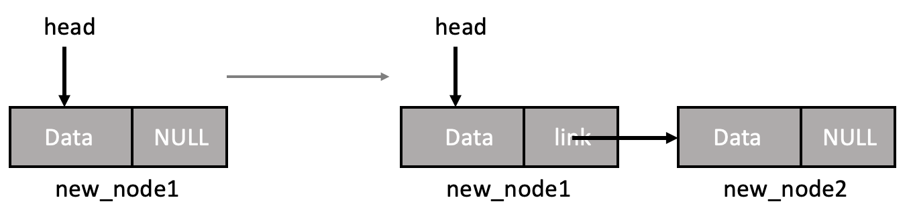
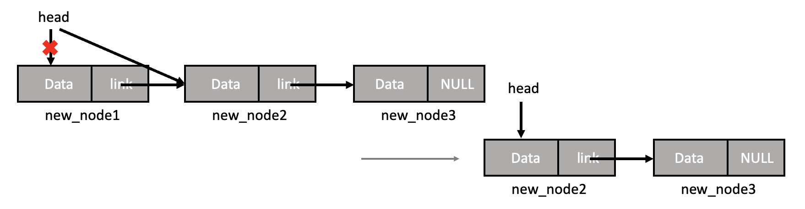
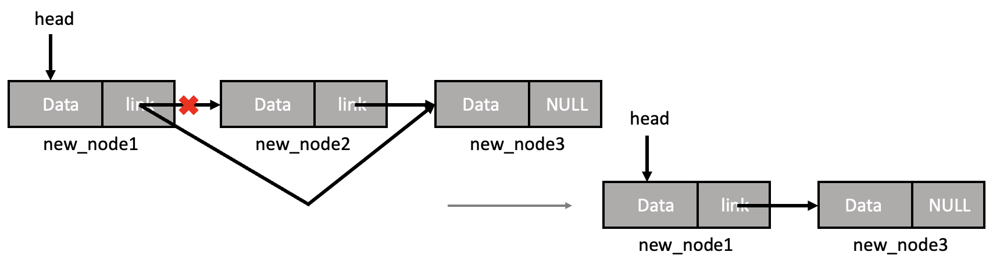
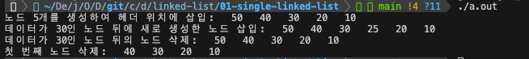
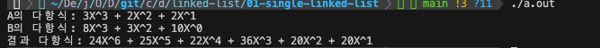

# 3-1 단순 연결 리스트

단순 연결 리스트는 각 노드가 다음 노드를 가리키는 방식으로 구현된 연결 리스트이다.



첫 번째 원소를 가리키는 **시작 포인터**로 시작되며, 이를 이용함으로써 리스트의 첫 번째 노드에 접근하고 링크 필드를 통해 다음 노드로 이동하여 리스트를 순회하거나 수정할 수 있다. 또한 연결 리스트의 내부는 비어있는 상태라면, 시작 포인터는 `0` 또는 `NULL`로 초기화되어 있어야 한다.

```c
typedef strcut Node{
    int data;
    struct Node *link;   
}Node;

Node *head = NULL;
```

단순 연결 리스트는 앞의 노드가 뒤의 노드를 가리키는 방식이기 때문에 다음 노드에는 접근이 가능하지만, 이전의 노드에는 접근이 불가하다. 즉, 한 방향으로만 노드를 따라가기 때문에 앞 노드를 찾기 위해서는 다시 처음부터 링크를 따라가야 한다는 단점이 있다. 이러한 단점을 해결하기 위해서 나온 해결책으로 이전 노드의 링크도 저장하는 [이중 연결 리스트](https://github.com/junghyun21/ssu-os-lab/tree/main/computer-science/data-structure/linked-list/02-doubly-linked-list)가 있다.

<br><br>

### 연결 리스트의 삽입

새로운 노드를 삽입하는 경우 **빈 리스트인 경우**와 **리스트에 노드가 있는 경우**로 나뉜다. (만약 더미 노드(헤드 노드)가 있다면 경우를 나누지 않고도 코드 작성이 가능하다.)

빈 리스트인 경우는 시작 노드가 `NULL`인 상태로 새로운 노드를 생성하여 데이터를 저장하고 링크는 `NULL`로 설정한 후, 시작 노드가 새로운 노드를 가리키도록 한다.

```c
Node *new_node1 = (Node*)malloc(sizeof(Node)); // 새로운 노드 생성

new_node1->data = data;
new_node1->link = NULL;

head = new_node1;
```



리스트에 노드가 있는 경우는 시작 노드가 `NULL`이 아닌 상태로, x라는 노드 뒤에 새로운 노드를 삽입하고자 할 때에는 새로운 노드를 생성하여 데이터를 저장하고 링크는 x의 링크가 가리키는 노드로 설정한다. 이후 x의 링크는 새로운 노드를 가리키도록 한다.

```c
Node *new_node2 = (Node*)malloc(sizeof(Node)); // 새로운 노드 생성

new_node2->data = data;
new_node2->link = new_node1->link;

new_node1->link = new_node2;
```



<br><br>

### 연결 리스트의 삭제

노드를 삭제하는 경우는 **삭제할 노드가 첫 번째 노드인 경우**와 **그렇지 않은 경우**로 나뉜다. (만약 더미 노드(헤드 노드)가 있다면 경우를 나누지 않고도 코드 작성이 가능하다.)

첫 번째 노드를 삭제하는 경우는 시작 노드가 삭제되는 경우로, 시작 노드를 가리키는 포인터가 시작 노드의 다음 노드를 가리키도록 해야 한다. 또한 삭제할 노드의 동적 메모리도 해제해야 한다.

```c
// new_node1를 삭제하는 경우
head = head->link;

free(new_node1);
```


첫 번째가 아닌 노드를 삭제하는 경우에는 삭제할 노드의 이전 노드의 링크가 삭제할 노드의 다음 노드를 가리키도록 해야 한다. 또한 삭제할 노드의 동적 메모리도 해제해야 한다.

```c
// new_node2를 삭제하는 경우
new_node1->link = new_node2->link;

free(new_node2);
```



<br><br>

### 예제

> *단순 연결 리스트의 생성/삽입/삭제/탐색/출력*

[source](./single_linked_list.c)  

- `createNode()`: 새로운 노드 생성
- `insertHead()`: 새로운 노드를 리스트의 헤더에 삽입
- `insert()`: 새로운 노드를 특정 노드 x 뒤에 삽입
- `delete()`: 연결 리스트 내 노드 삭제
- `search()`: 리스트 내 특정 데이터를 저장하고 있는 노드 검색
- `printList()`: 리스트 출력
- 출력 결과

    

<br>

> *다항식의 덧셈 및 곱셈*

```c
// 연결리스트 노드의 구조
typedef struct Node{
    int coef; // 계수(coefficient)
    int expon; // 지수(exponent)
    struct Node *next;
}Node;
```

[[source] 다항식의 덧셈](./polynomial_addition.c)


- `init()`: 연결 리스트 초기화
- `insertNodeLast()`: 새로운 노드를 연결 리스트의 마지막에 삽입
- `polyAdd()`: 각 연결 리스트(다항식)들을 더해서 새로운 연결 리스트에 저장
- `polyDelete()`: 연결 리스트(다항식) 삭제
- `polyPrint()`: 연결 리스트를 다항식 형식으로 출력
- 출력 결과

    

<br>

[[source] 다항식의 곱셈](./polynomial_multiplication.c)

- `init()`: 연결 리스트 초기화
- `insertNodeLast()`: 새로운 노드를 연결 리스트의 마지막에 삽입
- `polyMul()`: 각 연결 리스트(다항식)들을 곱해서 새로운 연결 리스트에 저장
- `polyDelete()`: 연결 리스트(다항식) 삭제
- `polyPrint()`: 연결 리스트를 다항식 형식으로 출력
- 출력 결과

    