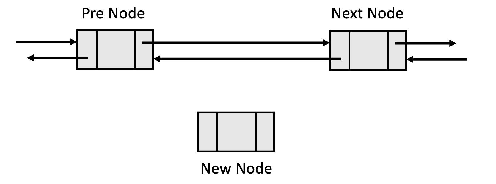
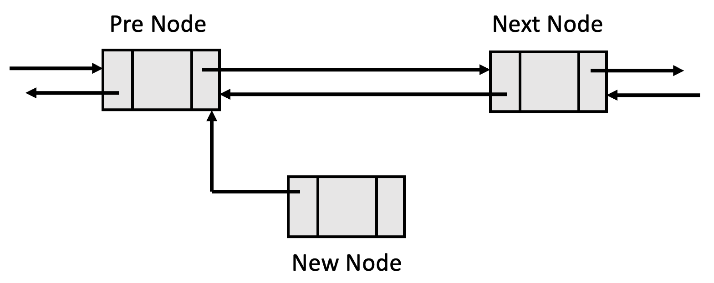
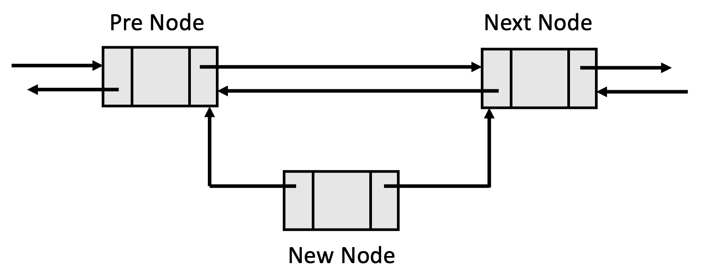
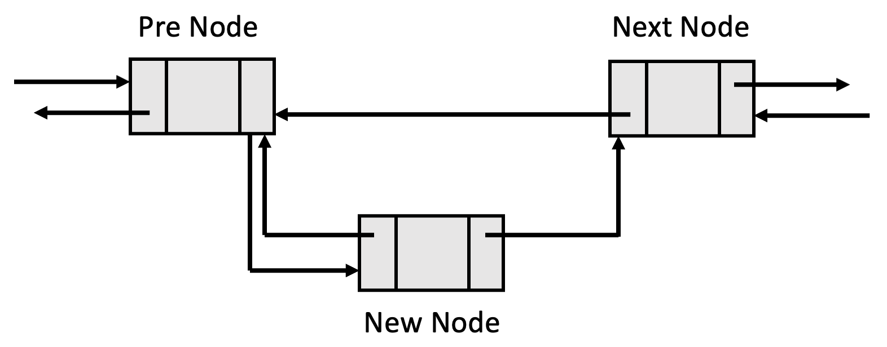
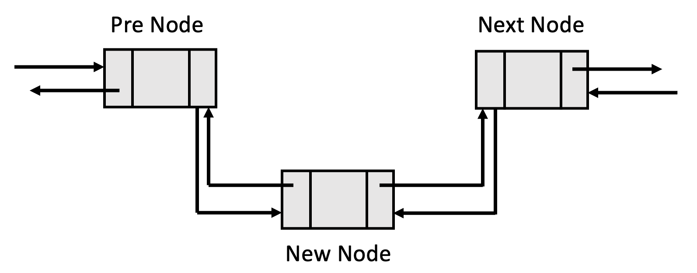
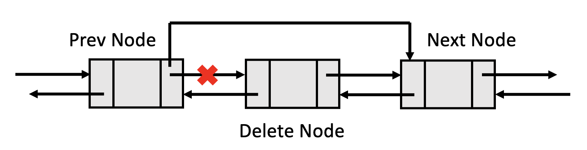
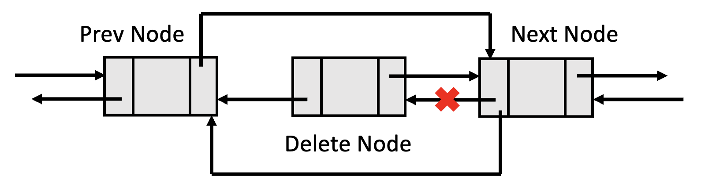
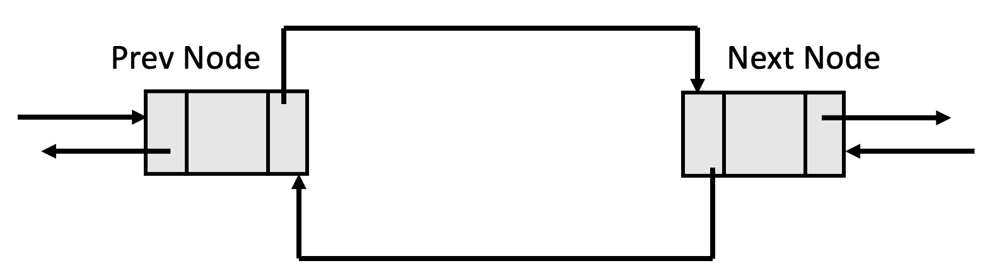

# 3-2 이중 연결 리스트

각 노드에 링크를 2개 만들어 앞/뒤 노드를 가리키도록 한 연결 리스트로, 이를 통해 단순 연결 리스트의 단점을 보완할 수 있다.

- 임의의 노드를 삭제하기 위해서는 앞/뒤 노드 포인터를 알아야 함
- 단순 연결 리스트는 다음 노드는 찾아갈 수 있지만, 이전 노드로 돌아갈 수 없음
- 따라서 노드의 위치만큼 처음부터 링크를 다시 따라가야 하는 오버헤드(O(n)) 발생함

이러한 단순 연결 리스트와는 달리 이중 연결 리스트는 각 노드에 **앞 노드를 가리키는 링크**와 **뒷 노드를 가리키는 링크**를 두어, 앞 뒤 어느 방향으로든 접근이 가능하도록 하였다. 이러한 특징으로 양방향 리스트(Two-way Linked-list)라고 부르기도 한다. 또한 노드의 앞쪽을 나타내는 링크를 `llink(left link)`, 뒤쪽을 나타내는 링크를 `rlink(right link)`라고 했을 때, `ptr = ptr->llink->rlink = ptr->rlink->llink` 라는 성질을 가진다.


- 노드 삭제 시, 이전 노드를 얻기 위해 리스트를 전체적으로 탐색할 필요가 없음
- 그러나 각 노드마다 이전 포인터를 위한 추가 공간을 필요로 함
- 두 개의 포인터(링크)가 관리되어야 한다는 번거로움도 있음

```c
// 이중 연결 리스트를 위한 구조체 선언
typedef struct Node{
    int data;
    struct dNode llink; // 노드의 앞쪽을 나타내는 링크 (left link)
    struct dNode rlink; // 노드의 뒤쪽을 나타내는 링크 (right link)
}Node;
```

<br><br>

### 노드 삽입

[[source] 이중 연결 리스트에서 노드 삽입](./insert.c)  


```c
// node의 뒤쪽(오른쪽)에 newNode를 삽입
void insert(Node *node, Node *newNode)
{
    newnode->llink = node;
    newnode->rlink = node->rlink;
    node->rlink = newnode;
    newnode->rlink->link = newnode;
}
```

1. 삽입할 새로운 노드를 생성한다.

    

2. 새로운 노드의 left link를 삽입할 위치 앞에 있는 노드로 설정한다.

    

3. 새로운 노드의 right link를 삽입할 위치 뒤에 있는 노드로 설정한다.

    

4. 삽입할 위치 앞에 있는 노드의 right link를 새로운 노드로 설정한다.

    

5. 삽입할 위치 뒤에 있는 노드의 left link를 새로운 노드로 설정한다.

    


<br><br>

### 노드 삭제

```c
// node 뒤쪽(오른쪽)에 있는 deleteNode 삭제
void insert(Node *node, Node *deleteNode)
{
    // 헤드 노드를 삭제하는 경우 리스트의 무결성이 깨질 수 있기 때문에 보통 예외처리 해줌
    // 헤드 노드를 사용하지 않은 경우에는
    // 삭제할 노드가 헤드 노드인지 아닌지에 따라 코드를 작성해주면 됨
    if(node == delete)
        fprintf(stdout, "헤드 노드 삭제 금지\n");
    else{
        deleteNode->llink->rlink = deleteNode->rlink;
        deleteNode->rlink->llink = deleteNode->llink;
        free(deleteNode);
    }
}
```

1. 삭제할 노드 앞에 있는 노드의 right link를 삭제할 노드의 right link로 설정한다.

    

2. 삭제할 노드 뒤에 있는 노드의 left link를 삭제할 노드의 left link로 설정한다.

    

3. 삭제한 노드의 메모리를 해제하여 메모리 누수를 방지한다.

    

<br><br>

### 예제

> *이중 연결 리스트의 생성/삽입/삭제/출력*

[source](./doubly_linked_list.c)

- `createNode()`: 새로운 노드 생성
- `insert()`: 새로운 노드를 특정 위치에 삽입
- `deleteByPosition()`: 특정 위치에 있는 노드 삭제
- `deleteByValue()`: 특정한 값을 가지고 있는 노드 삭제
- `traverse()`: 연결 리스트를 앞에서부터 순회
- `traverseInReverse()`: 연결 리스트를 뒤에서부터 순회