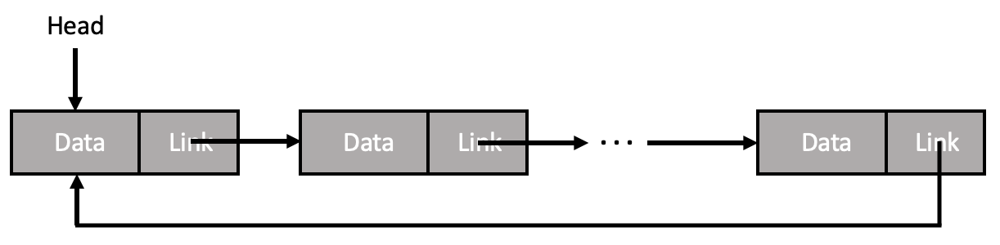
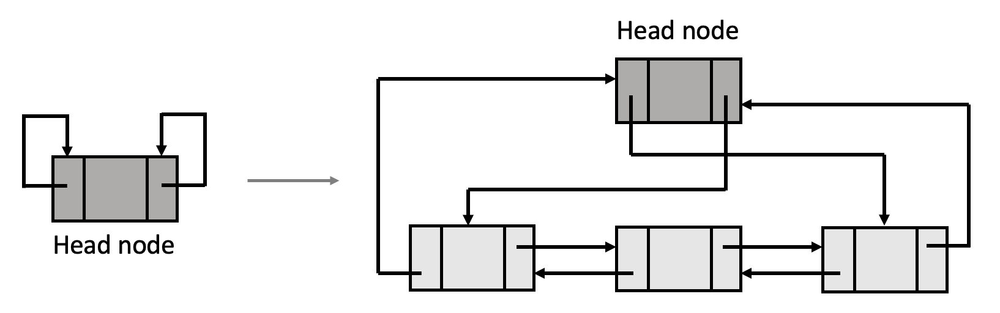

# 3-3 원형 연결 리스트

원형(환형) 연결 리스트는 마지막 노드가 첫 번째 노드를 가리키는 형태로, 모든 노드가 연속적인 원형으로 연결되어 있다.  즉, **환형 연결 리스트에는 NULL이 없다.** 

- 어떤 노드든 다른 노드에서 출발하여 순회할 수 있음
- 리스트의 모든 노드의 포인터들은 유효한 주소를 가짐
- 노드 삭제 시, 삭제 대상 원소의 이전 노드를 찾는 작업을 해당 원소에서부터 시작할 수 있음

 

다음은 더미 노드(헤드 노드)를 가지는 이중 원형 리스트이다. 이중 원형 연결 리스트는 첫 번째 노드의 left link가 마지막 노드의 주소를 가지고 있고, 마지막 노드의 right link가 첫 번째 노드의 주소를 가지고 있다. 만약 빈 리스트일 때에는 더미 노드만 있으며, 이 때 더미 노드의 left link와 right link는 모두 더미 노드 자기 자신을 가리킨다.

 

[[source] 단순 원형 연결 리스트의 생성/삽입/~~삭제~~/출력](./circularly_linked-list.c)

- `createNode()`: 새로운 노드 생성 및 노드 내의 값 초기화
- `insertNode()`: 새로운 노드를 첫 번째 위치(head가 가리키는 곳)에 삽입
- ~~`deleteByValue()`: 특정한 값을 가지고 있는 노드 삭제~~
    - ~~헤드 노드를 삭제하려는 경우, 리스트의 무결성이 깨질 수 있음~~
    - ~~보통 헤드 노드를 삭제할 때에는 예외 처리를 함~~
- `printCircularList()`: 원형 연결 리스트를 출력