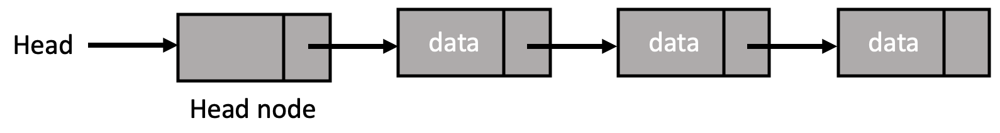

# 3. 연결 리스트 (Linked List)

리스트는 기본적으로 순차적인 방식으로 원소가 나열된 것으로, 나열된 순서대로 메모리에 연속적으로 저장된 **순차적 표현 방식**과 나열된 순서와 저장 순서가 다른 **비순차적 표현 방식** 두 가지로 표현할 수 있다. 배열에 리스트를 저장하는 방식은 순차적 표현 방식이고, 포인터나 링크를 통해 원소를 연결함으로써 연결 리스트에 리스트를 저장하는 방식은 비순차적 표현 방식이다.

- 순차적 표현 방식 (배열)

    리스트(sequence)의 원소들의 표현 순서가 **실제 메모리 내 저장 순서와 동일**한 형태

    - 리스트의 원소들을 연속적인 메모리에 순차적으로 저장
    - 임의의 원소에 접근하거나 스택 또는 큐에서 원소를 삽입/삭제하는 작업에 적합
    - 그러나, 삽입/삭제 시 다른 원소들의 위치 이동이 필수적이므로 연산 비용이 클 수 있음

- 비순차적 표현 방식 (연결 리스트)

    리스트(sequence)의 원소들의 표현 순서가 **실제 메모리 내 저장 순서와 다를 수 있는** 형태

    - 각 노드(원소)는 메모리에서 임의의 위치에 저장될 수 있으며, 다음 노드를 가리키는 포인터를 이용하여 순서 유지
    - 원소의 삽입/삭제가 상대적으로 간단함 (해당 위치의 노드 수정 및 연결만 해주면 됨)
    - 원소들의 순서가 변경되더라도 기존의 포인터만 수정하면 되므로 연산 비용이 상대적으로 작음
    - 그러나, 임의의 위치에 있는 원소에 접근하기 위해서는 리스트의 처음부터 순회해야 함 (직접적으로 원소에 접근 어려움)

배열 기반의 리스트와는 달리 연결 리스트는 **동적**이라는 장점이 있다. 따라서 운영 체제가 허용하는 메모리 양만큼의 자료들의 저장이 가능하다. 연결 리스트에는 단순(단일) 연결 리스트, 이중 연결 리스트, 환형(원형) 연결 리스트 등이 있다.

<br><br>

### 노드 (Node)

연결 리스트에서 노드(node)란 데이터를 저장하는 단위로, 데이터를 저장하는 **데이터 필드**와 다른 노드를 가리키는 **포인터(링크)**로 구성된다. 이는 보통 자신과 동일한 타입의 포인터를 멤버로 가지는 **자기 참조 구조체**를 사용하여 정의되며, 구조체의 형태는 연결 리스트의 종류에 따라 조금씩 달라진다.

```c
// (단순) 연결 리스트 노드를 나타내는 구조체
struct Node{
    int data; // 데이터를 저장하는 데이터 필드
    struct Node *next; // 다른 노드를 가리키는 포인터
};

// typedef를 이용하여 구조체 자료형을 간단하게 나타낼 수도 있음
// listPointer는 struct listNode * 를 나타내는 별칭
typedef struct Node *nodePointer;
typedef struct{
    int data;
    listPointer next;
}Node;
```

<br><br>

### 헤드 포인터(Head Pointer) vs 헤드 노드(Head Node)

헤드 포인터와 헤드 노드는 모두 리스트의 첫 번째 노드를 가리키는 역할, 즉 리스트의 시작을 나타내는 역할을 한다.

- 헤드 포인터(Head Pointer)

    

    - 연결 리스트의 첫 번째 노드를 가리키는 포인터
    - 리스트의 첫 번째 노드의 주소 저장
    - 삽입/삭제 시, 첫 번째 노드에 대한 처리를 따로 해주어야 함
    - 더미 노드(dummy node)를 사용하지 않았다고 말함

- 헤드 노드(Head Node)

    

    - 헤드 노드의 구조는 리스트의 노드 구조와 동일할 필요는 없음
    - 헤드 노드를 제외한 모든 노드가 선행 노드를 가짐
    - 만약 리스트가 비어 있는 상태라면, 리스트 내에는 헤드 노드만 존재하는 상태임
    - 삽입/삭제 시, 첫 번째 노드에 대한 처리를 따로 하지 않아도 됨
    - 더미 노드(dummy node)를 사용했다고 말함

<br><br>

### 더미 노드(Dummy Node)

기존의 노드들은 [리스트가 비어 있는 경우](https://github.com/junghyun21/ssu-os-lab/blob/0ada676f1e4de368918f69b8de06652a45a0c00a/computer-science/data-structure/linked-list/01-single-linked-list/single_linked_list.c#L95)나 [첫 번째 노드를 삭제하는 경우](https://github.com/junghyun21/ssu-os-lab/blob/0ada676f1e4de368918f69b8de06652a45a0c00a/computer-science/data-structure/linked-list/01-single-linked-list/single_linked_list.c#L113) 등등에서 여러 가지 예외 처리를 필수적으로 해주어야 했다. 이는 코드를 작성할 때 번거로움을 야기했다.

이러한 번거로움을 줄이기 위해 등장한 것이 **더미(Dummy) 노드**이다. 이는 실제로 데이터를 저장하지 않는 가상의 노드로, 리스트의 시작 또는 끝을 나타낸다. 연결 리스트 구현 시, 더미 노드의 사용 여부는 프로그래머에게 달려있다.

```c
// 새로 생성한 노드를 리스트의 마지막에 삽입 시, 더미 노드를 사용하지 않은 경우
Node *head = NULL;
Node *current;

Node *newNode = (Node*)malloc(sizeof(Node));
newNode->data = data;
newNode->next = NULL;

if(head == NULL){ // 새로운 노드 추가 시, 첫 번째 노드인지 판단 필요
    head = newNode;
}
else{
    current = head;
    while(current->next != NULL)
        current = current->next;

    current->next = newNode;
}
```

```c
// 새로 생성한 노드를 리스트의 마지막에 삽입 시, 더미 노드를 사용한 경우
Node *head = dummyNode;
Node* current;

Node *newNode = (Node*)malloc(sizeof(Node));
newNode->data = data;
newNode->next = NULL;

current = head;
while(current->next != NULL)
    current = current->next;

current->next = newNode;
```