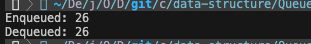
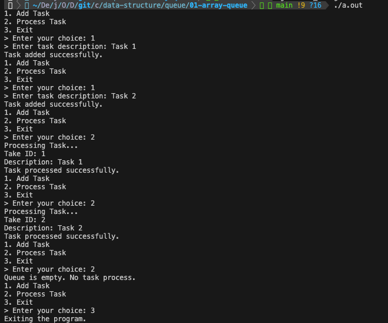

# 5-1 배열 기반의 선형큐

배열을 이용하여 스택을 구현할 수 있다. 이 때 장단점은 다음과 같다.

- 장점
    - 연결 리스트를 사용하여 큐를 구현하는 것보다 상대적으로 간단함
    - 인덱스를 사용하여 특정 위치의 원소에 빠르게 접근이 가능함
- 단점
    - 배열의 크기는 미리 정의되어 있으므로, 큐의 최대 크기에 제한이 있음
    - 동적배열로 구현하더라도 큐의 크기를 변경하기 위해서는 새로운 배열을 할당하고 데이터를 복사하는 과정을 거쳐야함
    - 원소가 제거될 때, 남은 원소들을 앞으로 이동시켜야 하며 이는 O(n)의 시간 복잡도를 가질 수 있음

<br>

일반(정적) 배열을 이용하여 구현한 큐의 정의는 다음과 같다.

```c
#define  MAX_QUEUE_SIZE 100 // 큐의 최대 크기
Typedef struct Element{
    int key;
}Element;

Element queue[MAX_QUEUE_SIZE]; // 큐 생성
int rear = -1; // 큐의 뒤쪽을 가리키는 부분
int front = -1; // 큐의 앞쪽을 가리키는 부분
```

[[source] 배열을 사용하여 간단한 큐 구현](./array_queue.c)



<br><br>

### 연산

> queue가 비어있는지 검사

큐가 비어있는 경우에는 삭제 연산을 진행할 수 없기 때문에, 삭제 연산 전에는 항상 큐가 비어있는지 검사를 해줘야 한다. 만약 rear와 front가 모두 -1이거나, front와 rear의 값이 동일하면 큐가 비어있음을 의미한다.

```c
int isQueueEmpty()
{
    return (front == rear);
}
```

<br>

> queue가 가득 차있는지 검사

큐가 가득 차 있는 경우에는 삽입 연산을 진행할 수 없기 때문에, 삽입 연산 전에는 항상 큐가 가득 차있는지 검사를 해줘야 한다. 만약 rear이 가리키는 인덱스가 배열의 마지막 인덱스(MAX_QUEUE_SIZE - 1)라면 큐가 가득 차있음을 의미한다. 다만, 배열의 앞부분이 비어있음에도 불구하고 큐가 가득 차있는 것처럼 확인될 수도 있다. 따라서 원소 삭제 시에 해당 위치에 특정 값을 채워놓고, 큐가 가득 찼을 때 원소들을 앞으로 옮기는 등의 작업을 통해 이를 해결할 수 있다.

```c
int inQueueFull()
{
    return (rear == MAX_QUEUE_SIZE - 1);
}

```

<br>

> 원소 삽입

큐에 원소를 삽입하기 전에는 **큐가 가득 차있는지 검사를 먼저 진행해야 한다.** 만약 큐가 가득 차있다면, 따로 큐 오버플로우 상황을 처리해야 한다.(ex. 오류 처리, 배열의 앞부분이 비어있다면 원소들 옮기기, ...) 그렇지 않은 경우에는 `rear 값을 증가`시킨 후, `queue[rear] 값에 원소를 저장`한다.

```c
void enQueue(Element item)
{
    if(isQueueFull()){
        printf("Queue is full. Cannot enqueue.\n");
        return;
    }
    queue[++rear] = item;
}
```

<br>

> 원소 삭제

큐 내 원소를 삭제하기 전에는 **큐 내에 원소가 있는지 검사를 먼저 진행해야 한다.** 만약 큐가 비어있다면, 따로 큐 언더플로우 상황을 처리해야 한다. 그렇지 않은 경우에는 `front 값을 증가`시킨다. 또한 앞부분이 비어있어도 큐가 가득 차있는 것으로 오해되지 않기 위해서는 삭제 연산 수행 시 front 값 증가 전에 삭제할 위치에 특정 값을 저장하는 등의 방법을 사용해야 한다.

```c
Element deQueue()
{
    if(isQueueEmpty()){
        printf("Queue is empty. Cannot dequeue.\n");
        Element emptyElement;
        emptyElement.key = -1; // 특정 값으로 저장하여 원소가 삭제되었음을 나타냄
        return emptyElement;
    }
    return queue[++front];
}
```

<br><br>

### 예제

> *배열로 구현한 큐를 사용하여 작성한 간단한 작업 관리 시스템 프로그램*

[source](./task_manager.c)  

