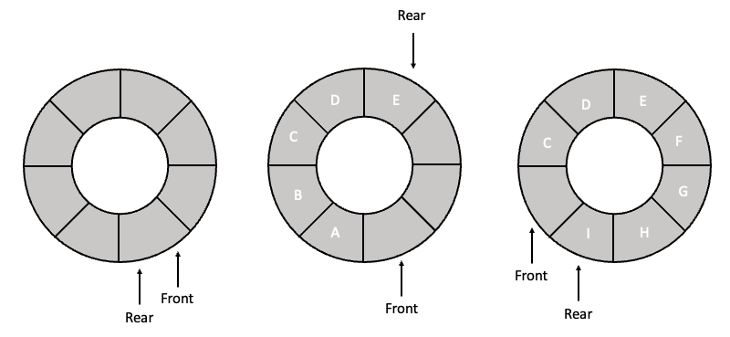
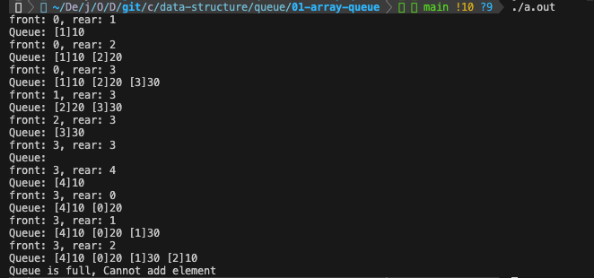
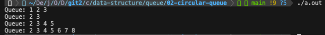
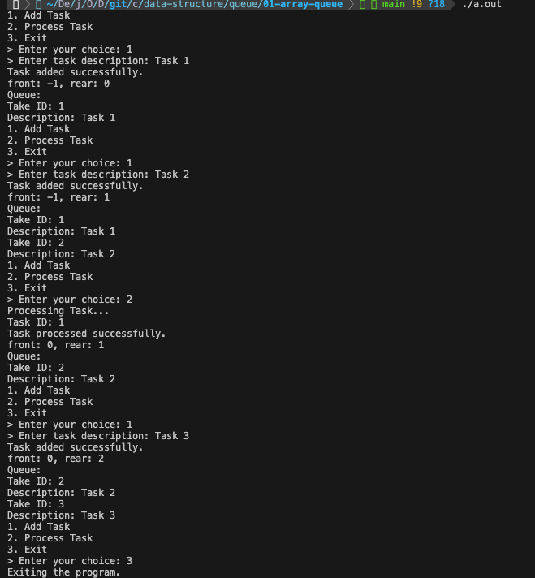

# 5-2 배열 기반의 원형큐

원형 큐는 배열의 끝과 처음을 연결하여, 일직선인 배열을 원형처럼 사용한 큐 구현 방식이다. 이러한 구조의 장점은 다음과 같다.

- 큐의 끝과 처음이 연결되어 있기 때문에, 큐의 끝에 도달하더라도 다음 원소를 큐의 처음에 추가할 수 있음
- 순환 구조를 가지고 있기 때문에, 선형 큐와 달리 큐의 마지막 인덱스에 도달한 경우에 큐의 앞부분이 비어있더라도 큐가 가득찬 것으로 오해받지 않음
- 일반적인 선형 큐보다 메모리 사용 및 연산에서 효율적임

<br><br>

### 연산

원형 큐에서 front는 첫번째 원소의 앞부분을 가리키고, rear는 마지막 원소를 가리킨다. 원소를 삽입할 때에는 rear를 하나 증가시키고, rear에 해당하는 위치에 원소를 삽입한다. 원소를 삭제할 때에는 front를 하나 증가시키고, 그 위치에서 데이터를 꺼내어 삭제한다. 이 때 front와 rear는 늘 `0 ~ (배열의 마지막 인덱스 번호 - 1)` 사이의 값을 갖는다.



<br>

`front == rear`이면 큐가 비어있는 상태로 판단하며, `(rear + 1) % MAX_QUEUE_SIZE == front`이면 큐가 가득 차있는 상태로 판단한다. 즉, 위의 그림에서 가장 왼쪽의 원형 큐는 큐가 비어있는 상태이며, 가장 오른쪽의 원형 큐는 큐가 가득 차있는 상태이다.

```c
// 정적 배열로 구현한 원형 큐 내 원소 삽입
void addQueue(Element item)
{
    // rear는 0~MAX_QUEUE_SIZE - 1의 값을 가질 수 있음
    // 원소를 삽입할 위치(rear + 1)로 이동
    rear = (rear + 1) % MAX_QUEUE_SIZE; 
    if(front == rear)
        queueFull(); // 큐가 포화상태인 경우, 오류 출력 또는 적절한 처리 수행
    queue[rear] = item; // 이동시킨 rear가 가리키는 곳에 원소 삽입
}
```

```c
// 정적 배열로 구현한 원형 큐 내 원소 삭제
Element deleteQueue()
{
    Element item;
    if(front == rear)
        return queueEmpty();
    // front는 0~MAX_QUEUE_SIZE - 1의 값을 가질 수 있음
    // 삭제할 원소의 위치(front + 1)로 이동
    front = (front + 1) % MAX_QUEUE_SIZE;
    return queue[front];
}
```

[[source] 정적 배열을 사용하여 간단한 원형 큐 구현](./circular_queue.c)



<br><br>

### 동적 배열로 구현한 원형큐

정적 배열로 구현한 원형큐와는 달리 동적 배열로 구현한 원형큐는 큐의 크기를 동적으로 조정할 수 있다. 즉, 큐가 가득 차면 동적으로 크기를 늘릴 수 있으며, 큐가 비어 있으면 크기를 줄일 수 있다. 다만 크기 변화를 처리해야 하므로 정적 배열로 구현한 원형큐에 비해 구현이 복잡하며, 큐에 원소를 추가하거나 제거하는 데 더 많은 시간이 걸릴 수 있다. (큐의 크기가 자주 변경되지 않는 한, 추가적인 오버헤드는 큰 문제가 되지 않는다.)

```c
// 동적 배열로 구현한 원형큐에서 원소 삽입
void addQueue(Element element)
{
    // capacity: 큐의 최대 용량
    rear = (rear + 1) % capacity;
    if(front == rear)
        queueFull();
    queue[rear] = item;
}
```

- `capacity`: 큐의 최대 용량으로, 큐가 가득 찬 상태인지를 검사할 때 사용됨
- `rear`: 큐의 뒷쪽을 가리키는 포인터로, 갱신한 rear 포인터가 배열의 끝에 도달하면 값을 다시 지정해주어야 함
- `front`: 큐의 앞쪽을 가리키는 포인터로, front와 갱신한 rear의 포인터가 같은 위치를 가리킨다면 큐가 가득 찬 것으로 간주함

<br>

```c
// 원형큐가 가득 찼을 때 큐의 용량을 2배로 확장하는 함수
// 기존의 큐의 변수명이 queue라고 가정
void queueFull()
{
    // 확장된 새로운 큐를 가리키는 포인터
    // malloc() 또는 realloc()을 사용하여 메모리를 할당
    Element *newQueue;
    newQueue = (Element *)malloc(2 * capacity * sizeof(*newQueue));

    // 기존의 큐에서 새로운 큐로 원소 이동
    int start = (front + 1) % capacity;
    if(start < 2)
        copy(queue + start, queue + start + capacity - 1, newQueue);
    else{
        copy(queue+start, queue + capacity, newQueue);
        copy(queue, queue + rear + 1, newQueue + capacity - start);
    }

    // 기존의 큐를 삭제하고 확장된 새로운 큐를 사용
    front = 2 * capacity - 1;
    rear = capacity - 2;
    capacity *= 2;
    free(queue);
    queue = newQueue;
}
```

- `newQueue`: 확장된 큐를 가리키는 포인터로, 현재 큐의 데이터를 해당 큐로 복사하는 과정을 진행해야 함
- `start`: 현재 큐의 앞쪽(front의 다음 위치, 큐 내에서 가장 처음에 입력된 데이터)의 인덱스로, 새로운 큐에 데이터 복사 시에 해당 인덱스가 가리키는 값이 새로운 큐의 가장 앞에 위치하도록 하기 위해 사용됨
    - `start < 2`
        - 현재 큐에서 front가 가리키는 인덱스가 0이였던 경우
        - 원형 큐의 뒷 부분에 데이터가 연속적으로 저장되어 있는 형태
        - 인덱스 1번부터 현재 큐의 마지막 인덱스까지의 값을 새로운 큐에 저장하면 됨
    - `start >= 2`
        - 현재 큐가 원형 큐를 한 바퀴 이상 돌아간 형태
        - 데이터를 **start가 가리키는 원형 큐의 첫 부분**과 **현재 큐의 인덱스 0번부터 저장되어 있는 나머지 부분**, 두 부분으로 나누어 복사를 해야 함
- `front`: 큐에 가장 먼저 저장된 원소 바로 이전의 인덱스를 가리켜야 하므로, 새로 생성된 큐의 가장 마지막 인덱스를 가리킴 (가장 먼저 저장된 원소는 인덱스 0)
- `rear`: 현재 큐가 가득 찼었기 때문에 현재 큐에서 모든 원소를 인덱스 0부터 저장했을 때, 저장이 가능한 마지막 인덱스를 가리킴 (원형 큐는 큐의 최대 용량보다 하나 작은 값만큼 원소 저장 가능)

<br>

[[source] 동적 배열을 사용하여 간단한 원형 큐 구현](./dynamic_circular_queue.c)



<br><br>

### 예제

> *배열로 구현한 큐를 사용하여 작성한 간단한 작업 관리 시스템 프로그램*

[source](./task_manager_circular.c)


