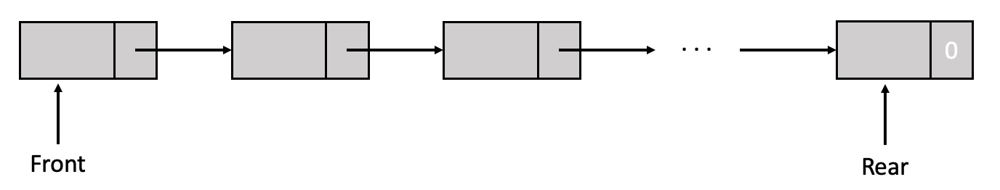
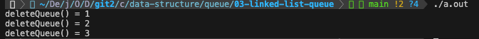

### 5-3 연결 리스트 기반의 큐

연결 리스트를 이용하여 큐를 구현할 수 있다. 이 때 장단점은 다음과 같다.

- 장점
    - 동적 메모리 할당을 통해 필요한 만큼의 노드를 생성하므로, 크기에 제한이 없고 효율적인 메모리 사용이 가능함
    - 원소의 삽입 삭제가 중간에서 일어나더라도 간단하게 노드를 연결하거나 끊어버리면 되므로, 배열보다 유연함
    - 
- 단점
    - 노드를 동적으로 생성 및 해제하고, 링크 필드를 조작하는 작업 등이 추가되기 때문에 배열로 만든 큐보다 코드가 더 복잡함
    - 각 노드는 데이터와 다음 노드를 가리키는 포인터로 이루어져 있으므로, 배열로 구현한 큐보다 더 많은 메모리 공간을 사용할 수 있음
    - 특정 원소에 접근을 할 때에는 포인터를 통한 접근으로 인해 선형 시간(O(n))이 걸림

따라서, 배열 기반의 큐는 사용하는 메모리가 적고 빠른 접근이 가능하므로 작은 큐 또는 고정 크기의 큐를 구현할 때 이용하는 것이 적합한 반면, 연결 리스트 기반의 큐는 크기가 동적으로 변하는 큐를 구현할 때 이용하는 것이 적합하다.



```c
// 연결 리스트를 이용한 큐의 구조체
#define MAX_QUEUES 10 // 생성할 큐의 최대 개수

typedef struct queue *queuePointer;
typedef struct{
    Element data;
    queuePointer Link;
}queue;

queuePointer front[MAX_QUEUES], rear[MAX_QUEUES];
```

<br><br>

### 연산

> 연결 큐에 삽입

```c
// 큐 i의 뒷쪽에 원소 삽입 (큐가 MAX_QUEUES개 있는 상황)
void addQueue(int i , Element item)
{
    queuePointer temp;
    temp = (queuePointer *)malloc(sizeof(*temp));
    temp->data = item;
    temp->link = NULL; // 새로 생성한 노드가 큐의 마지막 원소라는 것을 나타냄

    // 큐가 비어있는 상태가 아니라면, 마지막 값(rear)의 다음 값에 저장
    if(front[i])
        rear[i]->link = temp;
    // 큐가 비어있는 상태라면, 맨 앞에 추가
    else
        front[i] = temp;

    rear[i] = temp;
}
```

위의 함수는 여러 개의 큐 중에 i번째 큐에 새로운 원소를 삽입하는 함수이다. 연결 리스트 기반의 큐는 크기에 제한이 없기 때문에, 배열 기반의 큐와 달리 **삽입 연산 전에 큐가 가득 찼는지 검사할 필요가 없다.**

<br>

> 연결 큐에 삭제

```c
// 큐 i의 앞쪽 원소 삭제
Element deleteQueue(int i)
{
    queuePointer temp = front[i];
    Element item;

    // 만약 큐가 비어있는 상태라면, 큐가 비어있다는 오류 반환
    if(!temp)
        return queueEmpty();

    item = temp->data;
    front[i] = temp->link;
    free(temp);

    return item;
}
```

위의 함수는 여러 개의 큐 중에 i번째 큐에서 front에 위치한 원소를 삭제하는 함수이다. 삭제 연산 전에 큐가 비어있는지 확인해야 한다.

[[source] 연결 리스트를 이용하여 구현한 큐](./linked_list_queue.c)

