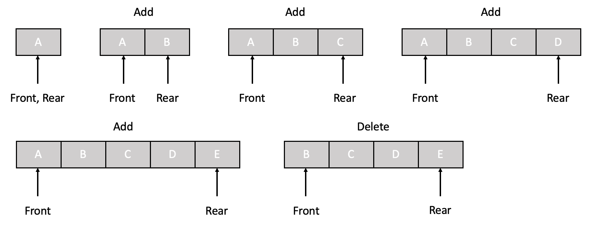

# 5. 큐 (Queue)

큐는 선형(Linear) 구조를 가지는 자료구조로, 원소들을 하나씩 순차적으로 나열시킨 형태를 가진다. 즉, 큐는 데이터를 저장하는 순서 리스트로 한쪽 끝(front)에서는 원소의 삭제가, 한쪽 끝(rear)에서는 새로운 원소의 삽입이 이루어진다. 이로 인해 가장 먼저 삽입된 원소가 가장 먼저 삭제되는 `선입선출(FIFO, Fisrt-In-First-Out)`의 특징을 가진다. 큐는 가장 먼저 데이터가 먼저 처리되므로, 작업 대기열을 구현할 때나 멀티스레딩 환경에서 데이터가 동기화될 때 등에서 사용된다.

큐를 구현하는 방법에는 배열을 이용하여 구현하는 방법과 연결 리스트를 이용하여 구현하는 방법이 있다. 또한 선형큐와 원형큐의 구조가 있다.
