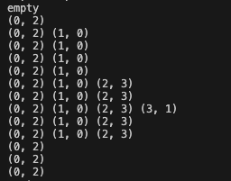

# 4-1 배열 기반의 스택

배열을 이용하여 스택을 구현할 수 있다. 이 때 장단점은 다음과 같다.

- 장점
    - 간단하게 선언 및 구현이 가능함
    - 배열은 인덱스를 통해 원소에 직접 접근하기 때문에 메모리 접근이 빠름
- 단점
    - 크기가 고정되기 때문에 크기 설정을 크게 하면 낭비가 발생함
    - 정적 배열로 구현할 시에는 동적으로 크기 조절이 어려움
    - 동적 배열로 구현하더라도 스택의 크기를 변경하기 위해서는 새로운 배열을 할당하고 데이터를 복사하는 과정을 거쳐야함

<br><br>

### 정적 배열 vs 동적 배열

정적 배열(static array)로 스택 구현 시, 구현 및 메모리 관리가 쉽다는 장점이 있다. 그러나 스택의 크기가 고정되어 있기 때문에 초기에 할당한 크기를 초과하면 추가적인 데이터 저장이 불가하며, 항상 최대 크기의 메모리를 사용해야 한다는 단점이 있다. 이를 보완하기 위한 방법으로 **동적 배열로 스택을 구현하는 방법**이 있다.

- 동적으로 메모리를 할당함으로써 스택의 크기를 동적으로 조절 가능함
- 메모리가 허용하는 범위 내에서 크기 조절이 가능함
- 그러나, 동적으로 메모리를 할당하고 해제하는 과정에서 오버헤드가 발생함
- 정적 배열에 비해서 구현이 좀 더 복잡해질 수 있음

```c
// 정적 배열을 통해 스택을 생성하는 방법
#define MAX_STACK_SIZE 100 // 스택의 최대 크기

typedef struct{
    int key; // 스택에 저장될 데이터(원소)
}Element;

Element stack[MAX_STACK_SIZE];
int top = -1; // 스택이 비어있는 상태
```

```c
// 동적 배열을 통해 스택을 생성하는 방법
typedef struct{
    int key; // 스택에 저장될 데이터(원소)
}Element;

Element *stack;
int capacity = 1; // 스택의 최대 크기 (초기에는 1로 설정, 필요에 따라 크기 변경됨)
int top = -1; // 스택이 비어있는 상태
```

[[source] 동적 배열을 이용하여 구현한 스택](./array_stack.c)


<br><br>

### 연산

> stack이 비어있는지 검사

스택이 비어있는 경우에는 삭제 연산을 진행할 수 없기 때문에, 삭제 연산 전에는 항상 스택이 비어있는지 검사를 해줘야 한다. 만약 `top == -1`이라면 스택이 비어있음을 의미하므로, `TRUE`를 반환한다.

```c
int isEmpty()
{
    if(top == -1)
        return TRUE;
    else
        return FALSE;
}
```

<br>

> stack이 가득 차있는지 검사

스택이 가득 차 있는 경우에는 삽입 연산을 진행할 수 없기 때문에, 삽입 연산 전에는 항상 스택이 가득 차있는지 검사를 해줘야 한다. 만약 `top >= (스택의 크기 - 1)`이라면 스택이 가득 차있음을 의미하므로, `TRUE`를 반환한다.

```C
// 정적 배열
int isFull()
{
    if(top >= MAX_STACK_SIZE - 1)
        return TRUE;
    else
        return FALSE;
}
```

```c
// 동적 배열
int isFull()
{
    if(top >= capacity - 1)
        return TRUE;
    else
        return FALSE;
}
```

<br>

> 원소 삽입

스택에 원소를 삽입하기 전에는 **스택이 가득 차있는지 검사를 먼저 진행해야 한다.** 만약 스택이 가득 차있다면, 따로 스택 오버플로우 상황을 처리해야 한다.(ex. 오류 처리, 스택의 크기 증가, ...) 그렇지 않은 경우에는 `top 값을 증가`시킨 후, `stack[top]에 원소를 저장`한다.

```C
// 전역 변수인 stack에 원소 item 저장
void push(element item){
    if(isFull())
        stackFull(); // 스택 오버플로우 상황을 처리하는 함수
    else
        stack[++top] = item;
}
```

<br>

> 원소 삭제

스택 내 원소를 삭제하기 전에는 **스택 내에 원소가 있는지 검사를 먼저 진행해야 한다.** 만약 스택이 비어있다면, 따로 원소 삭제가 불가능한 상황을 처리해야 한다. 그렇지 않은 경우에는 스택의 최상위 원소인 `stack[top]내에 저장된 원소를 반환`하고, `top 값을 감소`시킨다.

```C
// 전역 변수인 stack의 최상위 원소를 삭제하고 반환
element pop()
{
    if(isEmpty())
        return stackEmpty(); // 스택이 비어있을 때 오류를 처리하는 함수
    else
        return stack[top--];
}
```

<br>

> 오류 처리

스택이 가득 찼을 때 원소를 삽입하는 경우와 스택이 비어있을 때 원소를 삭제하는 경우에 대한 오류를 처리해주어야 한다.

```C
// 스택이 가득 찼을 때 원소를 삽입하는 경우
// 정적 배열: 에러 발생 후 종료
void stackFull()
{
    fprintf(stderr, "Stack is full, cannot add element");
    exit(EXIT_FAILURE);
}

// 동적 배열: stack의 크기 2배로 확장
void stackFull()
{
    // realloc(): 동적으로 할당된 메모리의 크기를 지정한 크기로 확장/축소
    stack = realloc(stack, 2 * capacity * sizeof(*stack));
    capacity *= 2;
}
```

```C
// 스택이 비어있을 때 원소를 삭제하는 경우
element stackEmpty()
{
    element temp;
    temp.key = ERROR_CODE;
    fprintf(stderr, "Stack is empty, cannot delete element");
    return temp;
}
```

<br><br>

### 예제

> *N-Queens 문제*

N-퀸 문제는 $N \times N$ 체스판 위에 N개의 퀸을 배치하는 문제로, 퀸은 같은 행/열/대각선에 다른 퀸이 없도록 배치되어야 한다.

[source](https://github.com/junghyun21/coding-test/tree/e02868fae33e064bd3f4f4ffbdb4c644fdaa7d56/%EB%B0%B1%EC%A4%80/Gold/9663.%E2%80%85N%EF%BC%8DQueen)


- `sloveNQueens()` 함수를 통해 해당 행에서 퀸이 놓일 수 있는 자리(row, col)를 스택에 저장하였음 
    1. `invail() == true` : 방금 저장한 자리가 이전의 퀸들과 같은 열/대각선에 없는 경우
        - 다음 행으로 이동
        - `sloveNQueens()` 호출
    2. 최근에 스택에 저장한 퀸의 자리(top) 삭제
- 만약 스택이 가득 찼다면, 모든 행에서 퀸이 놓일 수 있는 자리를 구한 것으로 경우의 수(cnt) 하나 증가시킴
- N = 4 일때, 경우의 수를 구하는 과정은 다음과 같다.

    1. (0, 0): 첫 번째 행의 퀸이 첫 번째 열에 존재하는 경우  
        
    2. (0, 1): 첫 번째 행의 퀸이 두 번째 열에 존재하는 경우  
        
    3. (0, 2): 첫 번째 행의 퀸이 세 번째 열에 존재하는 경우  
        
    4. (0, 3): 첫 번째 행의 퀸이 네 번째 열에 존재하는 경우  
        

    ⇒ 따라서 `isFull() == true`인 (0, 1)-(1, 3)-(2, 0)-(3, 2)와 (0, 2)-(1, 0)-(2, 3)-(3, 1)인 경우, 총 2가지 경우만 가능하다.

<br>

> *수식 표기법의 변환*

[[source] 정적배열로 구현한 후위표기법의 식을 중위표기법의 식으로 변환](./infix_to_postfix.c)


수식을 표기하는 방법으로는 중위, 전위, 후위 표기법이 있다. 보통 우리가 사용하는 식은 중위표기법으로 연산자의 우선 규칙을 따라야만 올바른 계산을 할 수 있다. 반면, 전위 및 후위표기법은 우선순위 규칙 없이 연산이 가능하다.

- 중위(infix) 표기법: $2 + 3 \times 4 $
- 전위(prefix) 표기법: $234 \times + $
- 후위(postfix) 표기법: $+ 2 \times 3 4 $

<br>

중위표기법의 식을 후위표기법의 식으로 바꾸는 것은 다음과 같다. 

1. 수식 문자열을 왼쪽에서 오른쪽으로 읽으면서 토큰 단위로 처리한다.
2. 토큰이 피연산자라면, 결과 문자열에 추가한다.
3. 토큰이 연산자 또는 열린 괄호라면, 스택에 저장한다.

    - 이 때, 스택의 top에는 스택에서 연산 우선순위가 가장 높은 연산자가 위치해야 한다.
    - 만약 그렇지 않다면, 위의 규칙이 지켜질 때까지 스택 내부의 연산자를 결과 문자열에 저장한다.

        ```c
        // (, ), +, -, *, /, %, \0
        int isp[] = {0, 19, 12, 12, 13, 13, 13, 0};
        int icp[] = {20, 19, 12, 12, 13, 13, 13, 0};
        ```
        - isp(in-stack precedence): 스택에 저장된 우선순위
        - icp(incoming precedence): 스택에 저장되기 전, 실제 연산자의 우선순위
        - 열린 괄호: 늘 스택에 저장되어야하기 때문에 **icp에서는 20**, 스택 내에서 열린 괄호가 있더라도 모든 연산자가 스택에 들어올 수 있어야하기 때문에 **isp에서는 0**

4. 토큰이 닫힌 괄호라면, 열린 괄호 전까지의 연산자를 결과 문자열에 삭제 순서대로 추가한다.

만약 중위표기법의 식인 $a+b*c$ 가 들어온다면, 다음과 같은 과정을 거쳐 $abc*+$ 이라는 후위표기법의 식으로 변환된다.


<br>

변환한 후위표기법의 식을 통해 수식을 계산하는 방법은 다음과 같다.

1. 후위표기법의 식을 왼쪽에서 오른쪽으로 읽으면서 토큰 단위로 처리한다.
2. 토큰이 피연산자라면, 스택에 저장한다.
3. 토큰이 연산자라면, 스택 내 피연산자를 두 개 꺼내어 계산한 후 결과 값을 스택에 저장한다.
4. 2번과 3번을 반복하면 마지막에는 스택에 수식의 결과값만 남는다.

만약 후위표기법의 식인 $62/3-42*+$ 가 들어온다면, 다음과 같은 과정을 거쳐 결과값인 8이 스택에 남는다.

