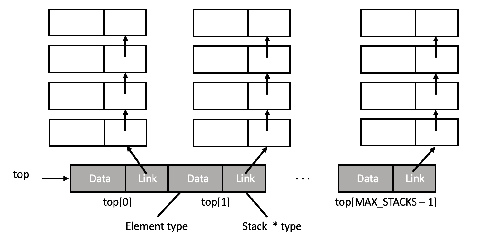
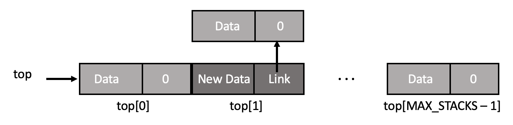
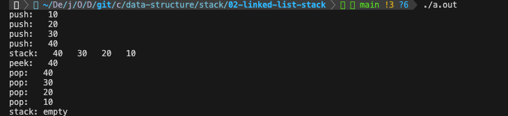

# 4-2 연결 리스트 기반의 스택

연결리스트를 이용하여 스택을 구현할 수 있으며, 이를 연결 스택(Linked stack)이라 부르기도 한다. 이 때 장단점은 다음과 같다.

- 장점
    - 스택의 동작 및 특성을 유지하면서 동적으로 크기 조절이 가능
    - 메모리가 허용하는 한 데이터 저장이 가능
    - 노드의 삽입/삭제 연산이 배열 기반의 스택보다 비교적 간단함
- 단점
    - 각 노드에 대한 메모리를 추가로 필요로 하기 때문에 저장 공간의 오버헤드 발생 가능성이 있음
    - 노드에 직접적으로 접근할 수 없으며, 순차적으로 접근해야 함

즉, 연결 스택은 크기가 동적으로 조절될 수 있어야 하는 경우나, 저장 공간이 제한 없이 필요한 경우에 유용하다.

<br><br>

### 연결 스택(Linked Stack)의 구조

연결 스택은 노드(node)라고 불리는 개별 원소로 구성된다. 각 노드에는 **데이터 필드**와 다음 노드를 가리키는 **링크(포인터) 필드**가 있다. 다음은 10개의 스택을 만들기 위한 스택의 정의이다.

```c
#define MAX_STACKS 10 // 스택의 최대 수

// 데이터 필드의 구조
typedef struct{
    int key;
}Element;

typedef struct Stack *stackPointer;
typedef struct Stack{
    Element data; // 데이터 필드
    stackPointer link; // 링크(포인터) 필드
}Stack;
stackPointer top[MAX_STACKS];
```



<br><br>

### 연산

> 원소 삽입

```c
void push(int i, Element item)
{
    stackPointer temp;
    temp = (stackPointer)malloc(sizeof(*temp));
    temp->data = item;
    temp->link = top[i];
    top[i] = temp;
}
```

위의 함수는 여러 개의 스택 중에 i번째 스택에 새로운 원소를 삽입하는 함수이다. 연결 리스트 기반의 스택은 크기에 제한이 없기 때문에, 배열 기반의 스택과 달리 **삽입 연산 전에 스택이 가득 찼는지 검사할 필요가 없다.** 단지 `새로운 원소를 담은 노드는 기존의 top[i]을 가리키고`, `top[i]에는 새로운 원소를 담은 노드를 저장`함으로써 새로운 원소를 삽입한다. 만약 인덱스(i)가 1인 스택에 새로운 원소를 삽입하게 된다면, 다음과 같이 데이터 구조가 변경된다.



<br>

> 원소 삭제

```c
Element pop(int i)
{
    stackPointer temp = top[i];
    element item;

    // temp == NULL
    if(!temp)
        return stackEmpty();

    item = temp->data;
    top[i] = temp->link;
    free(temp);

    return item;
}
```

위의 함수는 여러 개의 스택 중에 i번째 스택에서 top에 위치한 원소를 삭제하는 함수이다. 삭제 연산 전에 스택이 비어있는지 확인한 후, 그렇지 않다면 `삭제할 원소를 담은 노드가 가리키는 노드를 top[i]에 저장`하고 `삭제할 노드의 메모리를 해제`해줌으로써 원소를 삭제한다.

[[source] 연결 리스트를 이용하여 구현한 스택](./linked_stack.c)

