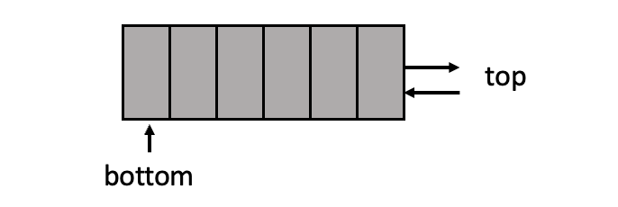
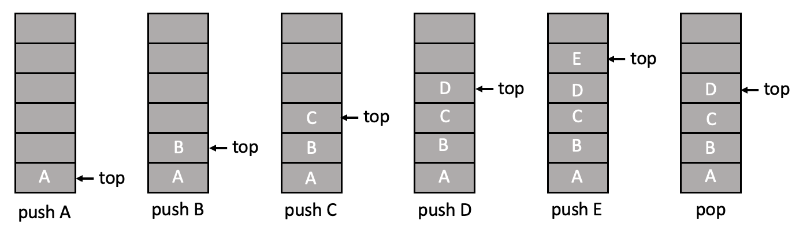

# 4. 스택 (Stack)

스택은 선형(Linear) 구조를 가지는 자료구조로, 원소들을 하나씩 순차적으로 나열시킨 형태를 가진다. 즉, 스택은 데이터를 저장하는 순서 리스트로, 삽입과 삭제 연산이 한 쪽(top)에서 이루어진다. 이로 인해 가장 최근에 삽입된 원소가 가장 먼저 삭제되는 `후입선출(LIFO, Last-In-First-Out)` 특징을 가진다.



<br>

스택이 생성될 때 스택의 바닥(base, bottom)은 고정되어 있고, 스택의 한 쪽 끝인 top은 원소의 추가 및 제거에 따라 변경된다. 스택은 원소를 삽입(push)하거나 삭제(pop)하는 연산이 있으며, 이 때 스택이 가득 찬 경우에는 원소의 삽입이 불가능하고, 스택이 비어있는 경우에는 원소의 삭제가 불가능하다.



스택을 구현하는 방법에는 [배열을 이용하여 구현하는 방법](https://github.com/junghyun21/ssu-os-lab/tree/main/computer-science/data-structure/stack/01-array-stack)과 [연결 리스트를 이용하여 구현하는 방법](https://github.com/junghyun21/ssu-os-lab/tree/main/computer-science/data-structure/stack/02-linked-list-stack)이 있다. 

<br><br>

### 스택의 원소 정의와 초기화

스택을 초기화하기 위해서는 먼저 스택의 크기를 결정해야 한다. 이후, 원소를 저장할 때에는 원소를 저장할 스택의 메모리 공간을 할당하고 이를 초기화 한다.

- 스택의 원소: 스택에 저장될 데이터
- 스택의 크기: 스택에 저장할 수 있는 원소의 최대 개수

```c
// 정적 배열을 통해 스택을 생성하는 방법
#define MAX_STACK_SIZE 100 // 스택의 최대 크기

typedef struct{
    int key; // 스택에 저장될 데이터(원소)
}Element;

Element stack[MAX_STACK_SIZE];
int top = -1; // 스택이 비어있는 상태
```

