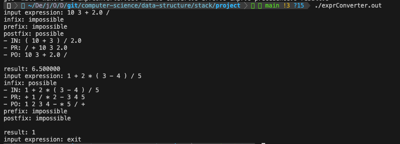
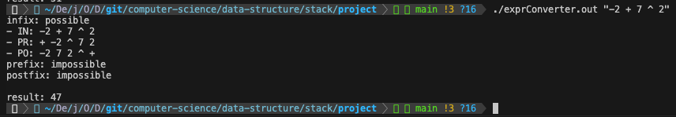
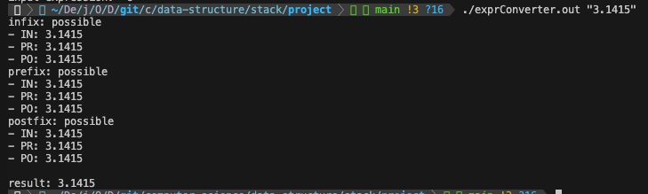
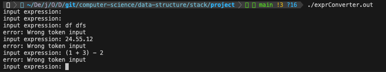
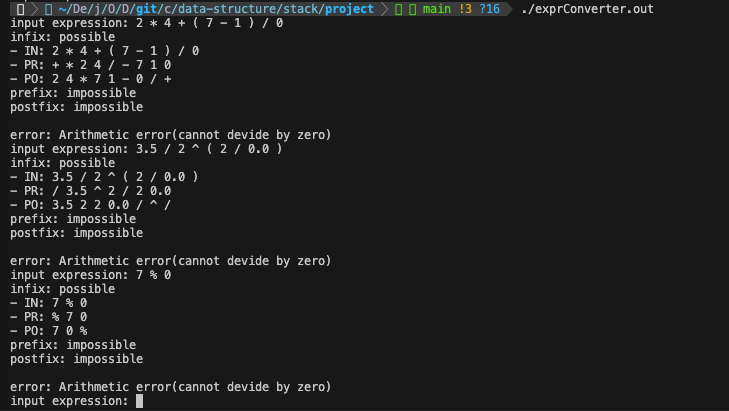

# [Project] 스택을 이용하여 구현한 수식 변환기

### 목표

수식은 전위식, 중위식, 후위식으로 나타낼 수 있다. 여러 수식 표기법 중 하나를 따르는 수식을 입력받고 해당 수식이 <u>1. 어떠한 표기법인지 분석</u>하고, <u>2. 다른 표기법들로 변환</u> 후 <u>3. 입력받은 수식의 결과를 출력</u>하는 프로그램을 작성한다. 이 때 수식을 입력 받는 방법은 명령행 인자로 받는 방법과 프로그램 실행 후 표준 입력으로부터 입력 받는 방법이 있으며, 표준 입력으로 받는 경우 `exit`를 입력받기 전까지 프로그램을 실행한다. (이때, 가능한 연산자는 `(`, `)`, `^`, `/`, `*`, `%`, `+`, `-` 총 8가지이다.)

 

### 구현 방법

총 3개의 연결 리스트 기반의 스택을 만들고, **중위식을 전위식 또는 후위식을 변환할 때**와 **전위식 또는 후위식을 중위식으로 변환할 때**와 **수식의 결과를 계산할 때**, 각각 필요한 스택을 통해 수식 변환 및 결과 계산을 진행하였다.

 

### 세부 내용

> precedence 파일

입력 받을 수 있는 문자(토큰)의 종류를 정의하고, 각 연산자들의 우선 순위를 저장한 파일

- `isp[]`: 연산자가 스택 내에서 가지는 연산자 우선순위
- `icp[]`: 연산자가 실제로 가지는 연산자 우선순위

 

> expr 파일

수식과 관련 있는 파일로, 수식을 저장할 공간과 수식에서 토큰을 가져오는 함수 등을 정의한 파일

- 변환해서 출력할 전위, 중위, 후위표기법의 식을 저장할 배열은 해당 파일에 전역 변수로 정의
- 사용자가 수식을 입력하였을 때 해당 수식이 올바른지, 어떠한 표기법인지 등의 입력 받은 수식 검사
- 특정 수식을 저장한 배열에서 한 문자(토큰)씩 자르고, 해당 문자가 어떠한 종류의 토큰인지 검사
- 스택에서 연산자를 가져와 배열에 저장할 때, 열거형 타입의 토큰을 문자형 타입으로 변환
- 변환한 수식 출력

 

> convert 파일

수식을 다른 표기식으로 변환할 때 필요한 스택 및 함수 등을 정의한 파일

- `Stack`: 중위식을 전위식 또는 후위식으로 변환할 때 사용하는 스택
    - 스택에는 연산자들이 저장됨
    - 각 연산자들의 우선순위만 비교하며 스택 관리
- `ToInfixStack`: 전위식 또는 후위식을 중위식으로 변환할 때 사용하는 스택
    - 스택에는 연산 과정 중 발생한 피연산자 및 중간식이 저장됨
    - 연산자의 입력 여부를 확인하며 스택 관리
- 수식을 변환하는 함수는 `중위식후위식`, `중위식->전위식`, `후위식->중위식`, `전위식->중위식` 총 4개
    - 전위식이 입력된 경우: 전위식 -> 중위식 -> 후위식
    - 중위식이 입력된 경우: 중위식 -> 전위식, 중위식 -> 후위식
    - 후위식이 입력된 경우: 후위식 -> 중위식 -> 전위식

 

> result 파일

수식의 계산 결과를 구할 때 필요한 스택 및 함수 등을 정의한 파일

- `evalStack`: 수식의 계산 결과를 구할 때 사용하는 스택
    - 스택에는 연산 과정 중 발생한 중간 결과 값이 저장됨
    - 정수 피연산자가 올지, 실수 피연산자가 올지 알 수 없기 때문에 각각의 멤버 변수를 필요 시에 동적 할당
    - 연산자의 입력 여부를 확인하며 스택 관리

 

### 실행 방법

1. `make` 명령어 실행
2. 생성된 `exprConverter.out` 파일 실행

 

### 실행 결과

- 표준 입력으로부터 수식 입력 받음

    

- 명령행 인자로 수식 입력 받음

    

    

- 예외 처리

    

    