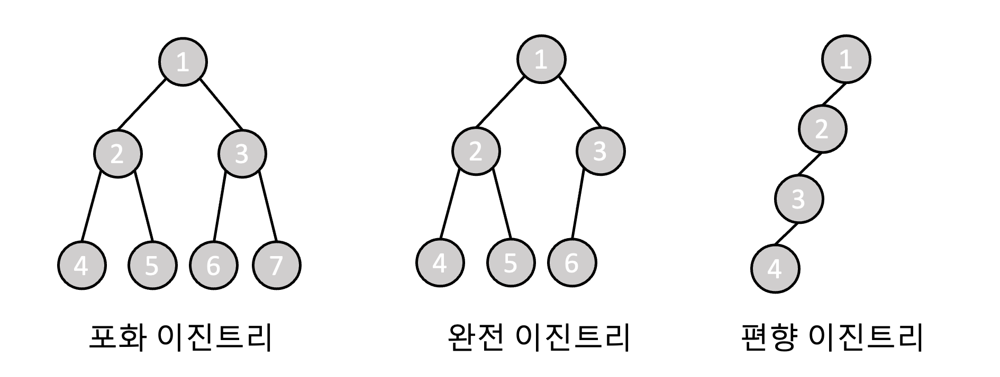
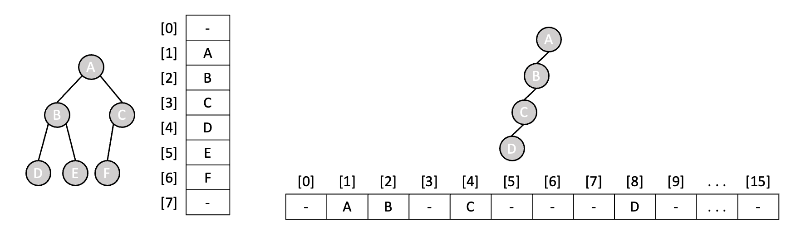
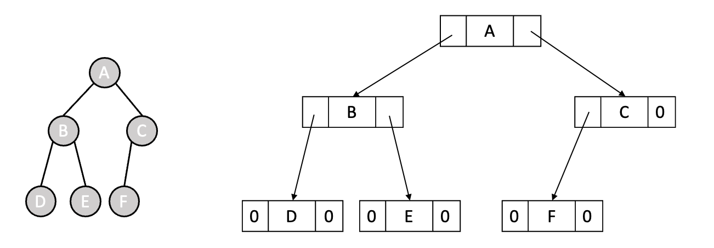
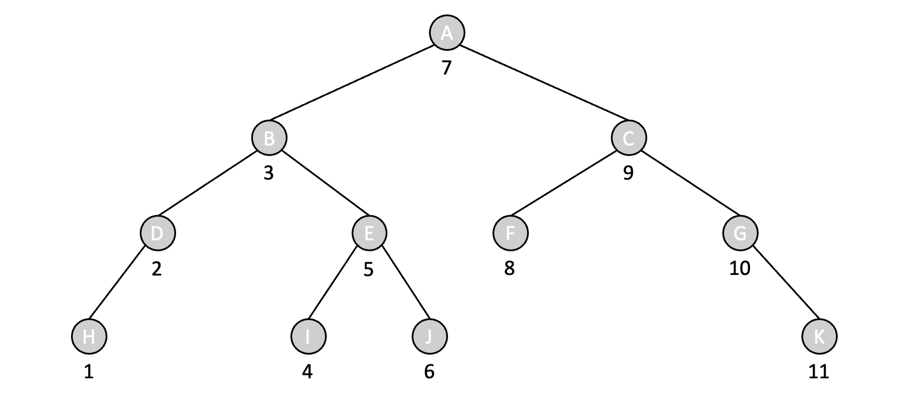
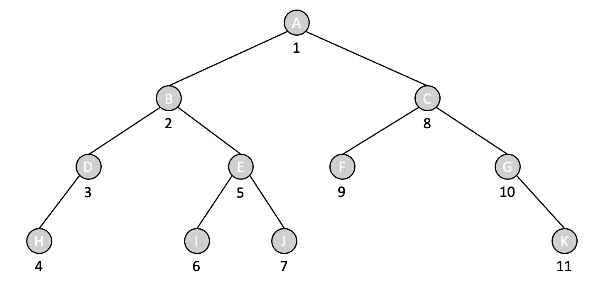
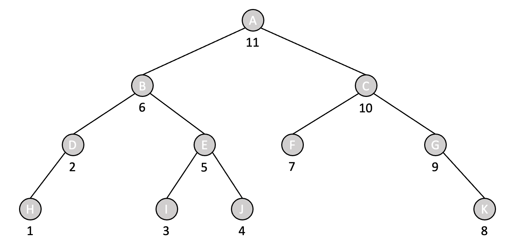
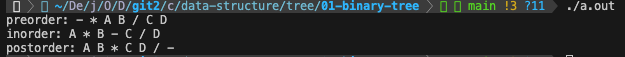

# 6-1 이진 트리

이진 트리는 **각 노드가 최대 두 개의 자식 노드를 가지는 트리 구조**이다. 각 노드는 데이터와 두 개의 서브트리를 가지며, 두 개의 서브트리(왼쪽 서브트리, 오른쪽 서브트리)는 해당 노드의 자식 노드들을 나타낸다. 만약 자식 노드가 없는 경우에는 공백 노드로 표현된다. 또한 이진 트리의 최대 높이가 h라면, 최대 노드 개수는 $2^{h+1} - 1$이다. (리프노드의 높이가 0이라고 가정) 이러한 이진 트리는 포화 이진 트리, 완전 이진 트리, 편향 이진 트리 등 다양한 유형으로 분류할 수 있다.

<br><br>

### 여러 유형의 이진 트리



> 포화(Full) 이진 트리

포화 이진 트리는 모든 레벨이 완전히 채워진 이진트리이다. 즉, 리프 노드를 제외한 **모든 내부 노드들은 2개의 자식을 갖는 이진 트리**이다. 포화 이진 트리의 리프 노드들은 모두 동일한 높이를 가지며, 트리의 높이가 h일 때 노드의 개수는 $2^{h+1} - 1$개이다. 이는 주로 데이터에서 최솟값 또는 최댓값을 빠르게 찾기 위해 사용되는 힙(heap) 자료구조와 관련이 있다.

<br>

> 완전(Complete) 이진 트리

완전 이진 트리는 포화 이진 트리의 리프 노드들을 오른쪽에서부터 제거하여 얻어진 트리이다. 즉, 노드가 왼쪽부터 오른쪽까지 채워지는 이진 트리이며, 트리의 높이가 h일 때 노드의 개수는 최소 $2^h$개, 최대 $2^{h+1}-1$개이다. 이는 **배열**로 효과적으로 구현할 수 있고, 그 덕분에 각 노드의 인덱스를 통해 부모 및 자식 노드를 쉽게 찾을 수 있다. 완전 이진 트리는 데이터의 삽입과 삭제가 툭정 규칙에 따라 이루어지는 경우에 유용하며, 힙(heap) 자료구조나 우선순위 큐(priority queue) 등의 구현에 주로 사용된다.

<br>

> 편향(Skewed) 이진 트리

편향 이진 트리는 모든 노드가 한 쪽으로만 편향된 형태의 이진 트리로, 최소 개수의 노드를 가지면서 왼쪽이나 오른쪽 서브 트리만을 가진다. 즉, 균형이 무너져 한 쪽 방향으로만 자식 노드를 가지는 트리로, 왼쪽 자식만을 가지고 있는 **왼쪽 편향 이진 트리**와 오른쪽 자식만을 가지고 있는 **오른쪽 편향 이진 트리**로 나눌 수 있다.

이와 같이 트리의 균형이 무너진 경우에는 일반적인 이진 트리의 장점을 활용할 수 없을 뿐만 아니라, 특히 **탐색과 관련된 연산 시간이 길어지며** 최악의 경우에는 연결 리스트와 유사한 성능(`O(n)`)을 보일 수도 있다. 따라서 아래와 같은 자료구조를 통해 트리의 균형을 조정하는 작업이 필요할 수 있다.

- [AVL 트리]()
- [레드-블랙 트리]()

<br><br>

### 배열을 이용한 이진 트리 구현

배열을 이용하여 이진 트리를 구현한다는 것은 **트리의 노드를 레벨 순서대로 배열에 저장**함을 의미하며, 특히 완전 이진트리와 같이 레벨 순서에 따라 노드가 채워진 경우에 효과적이다. 이는 각 노드를 배열의 특정 인덱스에 저장하기 때문에 `노드의 부모와 자식을 쉽게 찾는 것이 가능`하며, `특정 레벨의 노드에 순차적으로 접근하기 간단`하다. 배열의 크기는 **트리의 최대 높이**에 따라 달라진다. 트리의 최대 높이가 h라면 노드의 개수는 $2^{h+1}-1$이고, 편의를 위해 배열의 인덱스 1부터 값을 저장한다면 배열의 크기는 $2^{h+1}$이다.(배열의 인덱스: 0, 1, ..., $2^{h+1}-1$)

각 노드는  배열의 인덱스를 기준으로 부모 및 자식 노드의 위치를 찾을 수 있다. 트리의 노드를 저장할 배열을 T라고 가정했을 때, 우선 `루트 노드를 T[1]에 저장`한다. 특정 노드의 인덱스가 i라고 가정했을 때, 해당 노드의 `부모 노드는 T[i / 2]`이고 `왼쪽 자식 노드는 T[2 * i]`, `오른쪽 자식 노드는 T[(2 * i) + 1]`이다. 또한 `높이 m에서 k번째에 위치한 노드는 T[(2^m - 1) + k]`이다.



트리의 레벨 순서에 따라 노드를 배열에 저장하는 경우 공백 노드도 함께 저장될 수 있다. 이 때 **공백 노드는 자식 노드가 없음**을 의미하며, 특별한 값을 사용하거나 무시하면 된다. 또한 해당 구현 방식은 모든 레벨에 대한 공간을 확보하기 때문에 메모리 공간을 효율적으로 활용할 수 있지만, 실제 트리가 특정 깊이보다 얕은 경우 불필요한 공간 낭비가 발생할 수 있다. 따라서 트리의 크기를 예상하여 배열의 크기를 설정하는 것이 중요하다.

<br><br>

### 연결 리스트를 이용한 이진 트리 구현

연결 리스트를 이용하여 이진 트리를 구현한다는 것은 **부모 노드가 두 개의 자식 노드를 포인터로 가리키는 것**을 의미한다. 이를 가능하게 하기 위해 트리의 노드를 다음과 같이 `데이터 필드`와 `두 개의 링크 필드`로 구성된 구조체로 표현할 수 있다. 이 때 두 개의 링크 필드 중 하나는 현재 노드의 왼쪽 서브트리를 가리키고, 다른 하나는 현재 노드의 오른쪽 서브트리를 가리킨다.

```c
struct treeNode{
    int data;
    struct treeNode *left; // 왼쪽 자식을 가리키는 포인터
    struct treeNode *right; // 오른쪽 자식을 가리키는 포인터
};
```

<br>

연결 리스트를 이용한 이진 트리의 표현은 메모리 공간의 낭비가 없기 때문에 메모리 공간을 효율적으로 활용할 수 있으며, 트리의 크기를 동적으로 조절할 수 있기 때문에 노드의 삽입 및 삭제 연산이 용이하다.



[[source] 연결 리스트를 이용하여 구현한 이진 트리](./linked_list_binary_tree.c)

<br><br>

### 이진 트리의 순회(Traversal)

트리의 순회는 **트리 구조에서 노드를 방문하는 순서**이다. 순회 방법에 따라 트리를 탐색하고 데이터를 처리하는 방법이 달라지기 때문에, 특정 작업을 수행하기 위해 적절하게 선택되어야 한다. 가장 일반적인 이진 트리 순회 방법으로는 `중위 순회`, `전위 순회`, `후위 순회`가 있다. 이러한 순회 방법들은 이진 트리의 특성을 고려하여 설계되었기 때문에 이진 트리에서 가장 적합하게 활용 가능하다.

<br>

> 중위 순회 (Inorder Traversal)

**왼쪽 서브트리 -> 루트 -> 오른쪽 서브트리** 순서로 노드를 방문하는 순회 방법이다. 즉, `1.현재 서브트리 내 루트 노드의 왼쪽 서브트리를 중위 순회`하고 `2.루트 노드를 처리`한 후 `3.마지막으로 루트 노드의 오른쪽 서브트리를 중위 순회`까지 마친 후에, 루트 노드의 부모 노드로 돌아가는 형태를 가진다.



```c
typedef treeNode *treePointer;

// ptr: 순회를 시작할 노드를 가리키는 포인터로, 처음 호출 시에는 루트 노드 전달
void inorder(treePointer ptr)
{
    // 현재 노드가 존재한다면, 순회 계속 진행
    if(ptr){
        inorder(ptr->left); // 현재 노드의 왼쪽 서브트리 중위 순회
        fprintf(stdout, "%d\n", ptr->data); // 현재 노드 처리
        inorder(ptr->right); // 현재 노드의 오른쪽 서브트리 중위 순회
    }
}
```

<br>

> 전위 순회 (Preorder Traversal)

**루트 -> 왼쪽 서브트리 -> 오른쪽 서브트리** 순서로 노드를 방문하는 순회 방법이다. 즉, `1. 현재 서브트리 내 루트 노드를 처리`하고 `2. 루트 노드의 왼쪽 서브트리를 중위 순회`한 후 `3.마지막으로 루트 노드의 오른쪽 서브트리를 중위 순회`까지 마친 후에, 루트 노드의 부모 노드로 돌아가는 형태를 가진다.



```c
void preorder(treePointer ptr)
{
    // 현재 노드가 존재한다면, 순회 계속 진행
    if(ptr){
        fprintf(stdout, "%d\n", ptr->data); // 현재 노드 처리
        preorder(ptr->left); // 현재 노드의 왼쪽 서브트리 전위 순회
        preorder(ptr->right); // 현재 노드의 오른쪽 서브트리 전위 순회
    }
}
```

<br>

> 후위 순회 (Postorder Traversal)

**왼쪽 서브트리 -> 오른쪽 서브트리 -> 루트** 순서로 노드를 방문하는 순회 방법이다. 즉, `1. 현재 서브트리 내 루트 노드를 처리`하고 `2. 루트 노드의 왼쪽 서브트리를 중위 순회`한 후 `3.마지막으로 루트 노드의 오른쪽 서브트리를 중위 순회`까지 마친 후에, 루트 노드의 부모 노드로 돌아가는 형태를 가진다.



```c
void postorder(treePointer ptr)
{
    // 현재 노드가 존재한다면, 순회 계속 진행 
    if(ptr){
        postorder(ptr->left); // 현재 노드의 왼쪽 서브트리 후위 순회
        postorder(ptr->right); // 현재 노드의 오른쪽 서브트리 후위 순회
        fprintf(stdout, "%d\n", ptr->data); // 현재 노드 처리
    }
}
```

<br><br>

### 예제

[[source] 이진트리의 순회를 통한 수식 변환기](./expr_converter.c)

- 수식에 대한 이진 트리를 연결 리스트를 사용하여 생성
    - 주어진 수식: A * B - C / D
        ```
             -
           /   \
          *     /
         / \   / \
        A   B C   D
        ```

- 전위/중위/후위 순회를 통해 수식 변환하여 출력

    