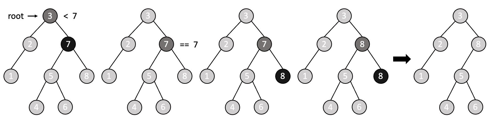

# 6-2 이진 탐색 트리

이진 탐색 트리(Binary Search Tree, BST)는 효율적인 데이터 탐색, 삽입 및 삭제를 위한 자료구조로, 자식 노드가 최대 두 개인 이진 트리의 형태이다. 이는 루트 노드를 기준으로 **왼쪽 서브트리의 모든 노드 값은 루트 노트 값보다 작고 오른쪽 서브트리의 모든 노드 값은 루트 노드 값보다 크다**는 특징이 있으며, 이로 인해 이진 탐색 트리를 `중위(in-order) 순회`를 통해 오름차순으로 정렬된 데이터를 얻을 수 있다.


<br>

이진 탐색 트리의 시간 복잡도는 `트리의 높이`에 의해 결정된다. n개의 원소를 저장할 수 있는 이진 탐색 트리의 최소 높이는 $\log_2{n}$, 최대 높이는 $n$이다. 따라서 해당 트리에 대한 탐색, 삽입, 삭제 연산에 대한 시간 복잡도는 최선의 경우에는 $O(\log{n})$, 최악의 경우에는 $O(n)$이다. 이 때 **최선의 경우는 노드가 트리에서 균형 있게 분포**되어 있는 경우를, **최악의 경우는 트리가 한 쪽으로 기울어지는 경향**이 있는 경우를 의미한다. 따라서 이진 탐색 트리 대신에 AVL 트리나 레드-블랙 트리 등과 같이 트리의 균형을 유지하는 자료구조를 사용함으로써 최악의 경우에도 $O(\log{n})$의 성능을 보장하도록 할 수 있다.

<br>

> 이진 탐색(binary search) vs 이진 탐색 트리(binary search tree)

이진 탐색과 이진 탐색 트리는 근본적으로 같은 원리에 의한 탐색 구조를 가진다. 즉, 두 개 모두 데이터를 반씩 나누어가며 탐색하는 구조를 가진다.

- 이진 탐색 (binary search)

    - 정렬된 배열에서 특정 값을 찾는 알고리즘
    - 시간 복잡도는 $O(\log{n})$이지만, 자료들이 배열에 저장되어 있으므로 삽입과 삭제가 상당히 어려움

- 이진 탐색 트리(binary search tree)

    - 정렬된 데이터를 트리 구조로 저장하는 자료구조
    - 비교적 빠른 시간 안에 삽입과 삭제가 가능함
    - 데이터의 삽입 및 삭제가 빈번히 일어나는 상황에서도 효율적으로 동작이 가능함
    - 균형을 유지하는 구조를 사용하면 항상 $O(\log{n})$의 성능을 보장할 수 있음

[[source] 간단한 이진 탐색 트리 예제 프로그램](./binary_search_tree.c)


<br><br>

### 탐색

이진 탐색 트리에서의 탐색 작업은 **재귀적 방법**을 통해 수행될 수 있다. 특정 값을 찾기 위해 루트 노드부터 시작하여 `1. 현재 노드의 값과 특정 값을 비교`하고 `2. 특정 값이 더 작다면 현재 노드의 왼쪽 서브트리로 이동`하고 `3. 특정 값이 더 크다면 현재 노드의 오른쪽 서브트리로 이동`하는 것을 **특정 값을 찾거나, 트리의 끝에 도달할 때까지** 반복한다.

```c
int search_binary(int list[], int low, int high, int target)
{
    // 원소를 찾지 못한 경우: 오류값 반환
    if(low > high)
        return - 1;

    int mid = (low + high) / 2;

    // 원소를 찾는 경우: 해당 원소가 위치한 인덱스 반환
    if(list[mid] == target)
        return mid;
    // 찾고자 하는 값이 가운데에 위치한 값보다 작은 경우: 왼쪽 서브트리로 이동
    else if(list[mid] < target)
        return search_binary(list, low, mid - 1, target);
    // 찾고자 하는 값이 가운데에 위치한 값보다 큰 경우: 오른쪽 서브트리로 이동
    else
        return search_binary(list, mid + 1, high, target);
}
```

<br><br>

### 삽입

이진 탐색 트리는 중복된 값을 허용하지 않는다. 즉, 트리에 동일한 키의 노드를 중복해서 삽입할 수 없기 때문에 **새로운 노드를 삽입하기 전에 이진 탐색을 수행하여 트리 내부에 해당 원소의 존재 여부를 먼저 검사**해야 한다.

```c
typedef struct TreeNode{
    int data;
    struct TreeNode *left;
    struct TreeNode *right;
}TreeNode;

TreeNode *insert(TreeNode *root, int data)
{
    // 현재 노드를 기준으로 빈 트리인 경우: 새 노드를 생성하여 반환
    if(root == NULL)
        return createNode(data);

    // 이진 탐색 트리 내 원소는 중복될 수 없음
    // 트리 내에 삽입하고자 하는 원소와 동일한 원소가 있는 경우: 아무 작업도 하지 않음
    if(data == root->data)
        return root;

    // 삽입하고자 하는 원소 < 현재 노드의 데이터
    // 왼쪽 서브트리에 삽입
    if(data < root->data)
        root->left = insert(root->left, data);
    // 삽입하고자 하는 원소 > 현재 노드의 데이터
    // 오른쪽 서브트리에 삽입
    else
        root->right = insert(root->right, data);

    return root;
}
```

이진 탐색 트리에 20, 15, 25, 12, 22라는 값들이 이미 존재하는 경우에 원소 23을 삽입하려고 할 때에는 다음과 같은 순서에 따라 원소의 삽입이 진행된다.


<br><br>

### 삭제

이진 탐색 트리에서 노드를 삭제할 때에는 3가지 경우로 나뉜다.

1. 삭제할 노드가 리프 노드인 경우 (차수: 0)
2. 삭제할 노드의 자식 노드가 하나인 경우 (차수: 1)
3. 삭제할 노드의 자식 노드가 두 개인 경우 (차수: 2)

삭제할 노드의 차수가 0인 경우에는 `단순히 해당 노드를 삭제`하면 된다. 반면 자식 노드가 존재하는 노드를 삭제하는 경우에는 `삭제할 노드를 대체할 노드를 찾는 것`이 중요하다.

```c
TreeNode *deleteNode(TreeNode *root, int key)
{
    // 트리가 비어있는 경우
    if(root == NULL)
        return root;

    // 삭제할 노드를 찾기 위해 트리 탐색
    if(key < root->data){
        root->left = deleteNode(root->left, key);
    }
    else if(key > root->data){
        root->right = deleteNode(root->right, key);
    }
    // 삭제할 노드를 트리 내에서 찾은 경우 (key == root->data)
    else{
        // 1. 삭제할 노드가 리프 노드인 경우
        if(root->left == NULL && root->right == NULL){
            free(root);
            root = NULL;
        }
        // 2. 삭제할 노드의 자식 노드가 하나인 경우
        else if(root->left == NULL){
            TreeNode *temp = root;
            root = root->right;
            free(temp);
        }
        else if(root->right == NULL){
            TreeNode *temp = root;
            root = root->left;
            free(temp);
        }
        // 3. 삭제할 노드의 자식 노드가 두 개인 경우
        else{
            // 오른쪽 서브트리에서 가장 작은 값을 가진 노드 찾고
            // 찾은 노드의 값을 삭제할 노드의 위치로 복사하고
            // 오른쪽 서브트리에서 복사한 값을 가진 노드 삭제
            TreeNode *temp = findMin(root->right);
            root->data = temp->data;
            root->right = deleteNode(root->right, temp->data);
        }
    }

    return root;
}
```

> 삭제할 노드의 **자식 노드가 하나**인 경우

삭제할 노드가 하나의 자식 노드만 가지고 있는 경우에는 해당 노드를 삭제하고, 해당 노드의 자식 노드를 삭제한 노드의 부모 노드에 연결하면 된다.


<br>

> 삭제할 노드의 **자식 노드가 두 개**인 경우

삭제할 노드가 두 개의 자식 노드를 가지고 있는 경우에는 삭제할 노드를 대체할 적절한 노드를 찾아야 하며, 크게 두 가지 방법이 있다.

1. `왼쪽 서브트리에서 제일 큰 원소 값`을 갖는 노드로 대체
    
    - 왼쪽 서브트리에 대해 중위 순회를 수행하고, **가장 마지막에 방문한 노드**를 대체 노드로 선택
    - 선택한 노드의 값을 삭제할 노드의 위치로 복사
    - 왼쪽 서브트리에서 대체 노드로 선택된 노드 삭제

2. `오른쪽 서브트리에서 제일 작은 원소 값`을 갖는 노드로 대체

    - 오른쪽 서브트리에 대해 중위 순회를 수행하고, **가장 처음에 방문한 노드**를 대체 노드로 선택
    - 선택한 노드의 값을 삭제할 노드의 위치로 복사
    - 오른쪽 서브트리에서 대체 노드로 선택된 노드 삭제

이 때 삭제할 노드를 대체할 노드들은 항상 **리프 노드**이므로, 해당 노드 삭제 시에는 별 다른 작업 없이 노드만 삭제하면 된다.

