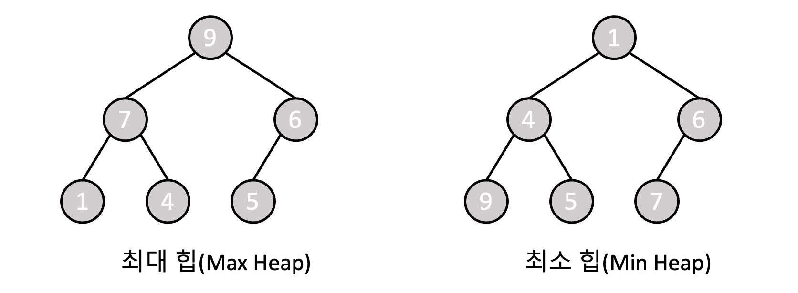
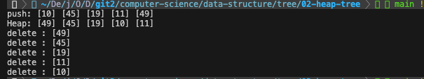
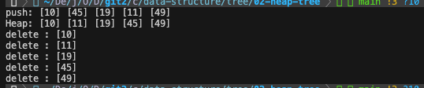

# 6-3 힙 트리

힙 트리(heap tree)는 **완전 이진 트리의 한 종류**이다. 노드 중에서 키 값이 가장 크거나 작은 노드를 효율적으로 찾기 위해 주로 사용되는 자료구조로, 부모 노드의 키 값이 자식의 키 값보다 크거나 같은 `최대 힙(max heap)`과 부모 노드의 키 값이 자식의 키 값보다 작거나 같은 `최소 힙(min heap)`이 있다. 키 값이 가장 큰 노드를 찾을 때에는 최대 힙을, 가장 작은 노드를 찾을 때에는 최소 힙을 사용한다.



<br>

힙 트리에서 노드를 삽입하거나 삭제하는 연산은 힙 트리가 완전 이진 트리 구조를 유지하기 때문에 `O(log n)` 시간 복잡도를 가진다. 따라서 우선순위 큐를 구현하거나 다익스트라 알고리즘과 같이 최댓값 또는 최솟값을 효율적으로 찾아야 하는 상황에서 활용된다. 또한 힙 트리는 완전 이진 트리의 형태를 가지기 때문에 `배열로 구현하는 것이 일반적`이고. 배열로 구현한 힙 트리에서는 각 노드에 고유하게 부여된 번호를 배열의 인덱스로 사용한다. 이로 인해 부모 및 자식 노드를 찾는 것이 간편해진다.

- 왼쪽 자식의 인덱스 = 부모의 인덱스 * 2
- 오른쪽 자식의 인덱스 = 부모의 인덱스 * 2 + 1
- 부모의 인덱스 = 자식의 인덱스 / 2

배열로 구현한 힙 트리에서 노드의 정의는 다음과 같다. 각 노드에게 부여되는 고유한 번호는 1부터 시작하므로, 힙에는 최대 `MAX_ELEMENTS - 1`개의 노드가 존재할 수 있다.

```c
#define MAX_ELEMENTS 200 // 최대 힙의 크기(노드 개수) = MAX_ELEMENTS - 1
#define HEAP_FULL(n) (n == MAX_ELEMENTS - 1)// 힙이 가득 찼는지 확인하는 매크로
#define HEAP_EMPTY(n) (!n) // 힙이 비어있는지 확인하는 매크로

typedef struct Element{
    int key;
}Element;

Element heap[MAX_ELEMENTS]; // 힙트리
int n = 0; // 노드의 개수
```

<br><br>

### 최대 힙 (Max Heap)

최대 힙은 항상 부모 노드의 값이 자식 노드의 값보다 크거나 같은 완전 이진트리이다. 루트 노드의 값이 가장 큰 값이므로 **최댓값**을 빠르게 찾을 수 있다.

[[source] 간단한 최대 힙 예제 프로그램](./max_heap.c)



<br>

> 삽입

1. 추가할 원소를 힙의 맨 끝에 추가
2. 추가할 원소를 부모 노드의 값과 비교
3. 추가할 원소가 부모 노드보다 값이 큰 경우에는 부모 노드와 위치 교체, 그렇지 않은 경우에는 최대 힙 재조정 완료
4. 추가할 원소의 인덱스가 1(루트 노드에 도달)이 될 때까지 2 ~ 3 반복

```c
void push(Element item, int *n)
{
    int i;
    
    // 힙이 가득 차있다면, 원소 삽입 불가
    if(HEAP_FULL(*n)){
        fprintf(stderr, "The heap is full.\n");
        exit(EXIT_FAILURE);
    }

    // i: 원소를 저장할 새로운 공간(노드)의 인덱스로 힙의 맨 끝에 추가
    i = ++(*n);

    // 새로 삽입할 노드의 값보다 부모노드의 값이 더 작다면 부모노드의 값을 자식 노드에 저장
    // 새로 삽입될 노드의 인덱스(i)를 찾아나감
    while((i != 1) && (item.key > heap[i/2].key)){
        heap[i] = heap[i/2];
        i /= 2;
    }

    // 새로 삽입될 노드를 힙에 저장
    heap[i] = item;
}
```

<br>

> 삭제

1. 루트 노드에 있는 값을 저장하고, 힙의 맨 끝에 위치한 노드를 루트 노드 위치로 이동
2. 이동시킨 노드와 자식 노드의 값을 비교
3. 해당 노드가 자식 노드의 값보다 작은 경우에는 자식 노드와 위치 교체, 그렇지 않은 경우에는 최대 힙 재조정 완료
4. 이동시킨 노드의 인덱스가 현재 노드의 개수보다 커지지 않을 때까지 2 ~ 3 반복

```c
Element pop(int *n)
{
    int parent, child;
    Element item, temp;

    // 힙이 비어있다면, 원소 삭제 불가
    if(HEAP_EMPTY(*n)){
        fprintf(stderr, "The heap is empty\n");
        exit(EXIT_FAILURE);
    }

    // 삭제할 원소인 루트 노드의 값을 저장
    item = heap[1];

    // 힙의 마지막 원소를 temp에 저장하고, 이를 루트 노드의 자식부터 비교해가며 힙 재조정
    temp = heap[(*n)--];
    parent = 1; // 부모 노드를 가리키는 인덱스 (초기값: 루트노드)
    child = 2; // 자식 노드를 가리키는 인덱스 (초기값: 루트노드의 왼쪽 자식)

    // 노드를 가리키는 인덱스는 노드의 최대 개수보다 커질 수 없음
    while(child <= *n){
        // child: 두 자식 노드 중 더 큰 값을 가지는 노드의 인덱스
        // child == n: 해당 자식 노드가 마지막 노드이므로, 오른쪽 자식은 존재하지 않음
        if((child < *n) && (heap[child].key < heap[child + 1].key))
            child++;

        // 힙의 마지막 원소가 자식 노드보다 큰 값을 가지고 있다면 힙 재조정 종료
        if(temp.key >= heap[child].key)
            break;

        // 가장 큰 자식 노드의 값을 부모 노드에 저장
        heap[parent] = heap[child];
        
        // 부모 노드에 값이 저장된 노드의 인덱스가 부모 노드의 인덱스 값이 됨
        parent = child;
        child *= 2;
    }

    // 힙의 마지막 원소를 저장한 temp를 올바른 위치에 저장
    heap[parent] = temp;

    return item; 
}
```

<br><br>

### 최소 힙 (Min Heap)

최소 힙은 항상 부모 노드의 값이 자식 노드의 값보다 작거나 같은 완전 이진트리이다. 루트 노드의 값이 가장 작은 값이므로 **최솟값**을 빠르게 찾을 수 있다. 또한 최대 힙과 동작 방식이 굉장히 유사하며, 부모 노드의 값이 자식 노드의 값보다 작거나 같다는 점에서만 차이가 있다.

[[source] 간단한 최소 힙 예제 프로그램](./min_heap.c)

