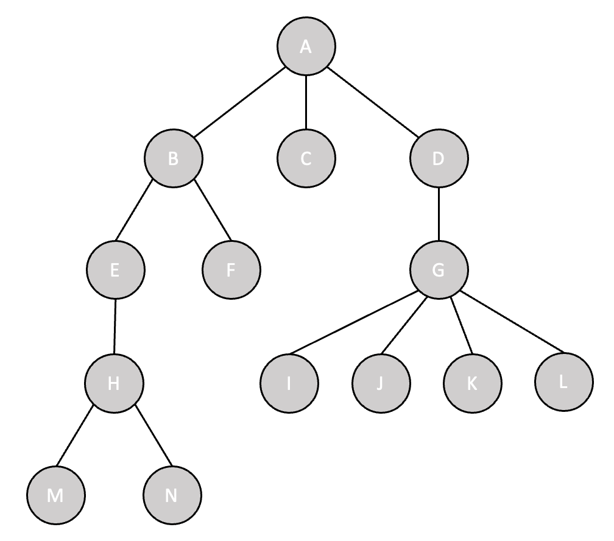
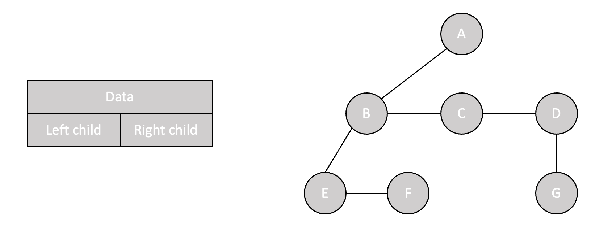

# 6. 트리 (Tree)

트리는 비선형(Non-Linear)구조의 자료구조로, 노드 간의 부모(parent)와 자식(child) 관계를 갖는 계층적 형태를 나타낸다. 트리는 1개 이상의 노드로 이루어진 유한 집합이며, 하나의 루트(root) 노드에 각 노드들이 연결되어 있다. 또한 각 노드는 0개 이상의 자식 노드를 가질 수 있다.

  

### 주요 용어

- `노드(node)`
    - 트리에서 각각의 데이터를 나타내는 기본 요소
    - 다른 노드로 연결되는 가지를 가진 정보 아이템
- `노드의 차수(degree of node)`
    - 특정 노드의 자식 노드의 수
    - 한 노드의 서브 트리의 수 (자식들마다 하나의 서브트리 가짐) 
- `트리의 차수(degree of tree)`
    - 트리에서 가장 많은 자식을 가진 노드의 차수
- `서브 트리(subtree)`
    - 특정 노드를 루트 노트로 하며, 해당 노드와 그 노드의 모든 자손들로 이루어진 트리
- `레벨(level)`
    - 루트 노드로부터의 특정 노드의 깊이
    - 같은 깊이를 가지고 있는 노드를 묶어서 레벨로 표현 가능
    - 루트 노드의 레벨은 1로 가정
    - 하위 계층으로 갈 수록 레벨은 증가함 (1, 2, ..., N)
- `트리의 깊이(depth of tree)`
    - 루트 노트부터 최대 레벨을 가진 노드까지의 거리
    - 루트 노드의 깊이는 0으로 가정
    - 하위 계층으로 갈 수록 깊이는 증가함 (0, 1, ..., N-1)
- `트리의 높이(height of tree)`
    - 리프 노드를 기준으로 루트 노드까지의 높이
    - 리프 노드의 높이는 0으로 가정
    - 하위 계층으로 갈 수록 높이는 감소함 (N-1, N-2, ..., 0)
- `리프(leaf)/단말(terminal) 노드`
    - 차수가 0인 노드
    - 자식 노드가 없는 노드
    - 트리 구조에서 맨 끝에 달린 노드
- `내부(internal) 노드`
    - 차수가 1 이상인 노드
    - 리프 노드 외의 모든 노드
- `부모(parent) 노드`
    - 서브 트리를 가지는 노드
    - 특정 노드와 직접적으로 연결된 상위 레벨의 노드
    - 한 노드는 하나의 부모 노드만 가질 수 있음
- `자식(child) 노드`
    - 특정 노드와 직접적으로 연결된 하위 레벨의 노드
    - 한 노드는 여러 개의 자식 노드를 가질 수 있음
- `형제(sibling) 노드`
    - 부모가 같은 자식 노드들
- `조상(ancestor) 노드`
    - 부모 노드들의 총 집합
    - 특정 노드의 부모, 부모의 부모, 그 이상의 모든 선조 노드들을 조상 노드로 간주
- `자손(descendant) 노드`
    - 특정 노드의 서브 트리 내에 있는 모든 노드들
    - 특정 노드의 모든 자식, 자식의 자식, 그 이하의 모든 후손 노드들을 자손 노드로 간주

  

### 트리의 표현 방법

트리의 노드를 표현하는 방법 중, 주로 사용되는 방법은 **리스트 표현 방법**과 **왼쪽 자식-오른쪽 형제 표현 방법**이다. 두 가지 방법 중 어떤 방법을 선택할지는 트리의 특성과 사용 목적에 따라 달라진다. 만약 트리의 차수가 크고 높이가 낮은 경우에는 리스트 표현이 적합하다. 반면 트리의 차수가 작고 높이가 높은 경우에는 왼쪽 자식-오른쪽 형제 표현이 적합하다.

> 리스트 표현 (List Representation)

각 노드는 데이터와 여러 개의 자식 노드를 가리키는 링크로 구성된다. 해당 방법은 트리의 구조를 효과적으로 나타내지만, 메모리 공간을 많이 사용할 수 있다.

 

> 왼쪽 자식-오른쪽 형제 표현 (Left Child-Right Sibling Representation)

각 노드는 최대 두 개의 링크를 가진다. 첫 번째 링크는 해당 노드의 자식 노드를 가리키고, 두 번째 링크는 해당 노드의 오른쪽 형제 노드를 가리킨다. 해당 방법은 트리의 구조를 간결하게 표현할 수 있으며, 메모리 공간을 좀 더 효율적으로 사용할 수 있다.

  

### 트리의 구현 방법

트리를 구현하는 방법은 크게 **배열을 이용하여 구현하는 방법**과 **연결 리스트를 이용하여 구현하는 방법**으로 나뉜다. 각각의 방법은 장단점이 있으며, 프로그램의 요구사항, 트리의 특성 등을 고려하여 적절한 방법을 선택해야 한다.

> 배열을 이용하여 구현하는 방법

트리를 선형 데이터 구조로 나타내는 방식이다. 일반적으로 트리를 배열을 이용하여 구현할 때에는 특정 순서로 노드를 나열하고 각 노드가 위치한 인덱스를 활용한다. 해당 방법은 이진 트리와 같이 트리의 구조가 규칙적이고, 각 노드의 차수가 일정한 경우에 사용하는 것이 적절하다.

- 장점
    - 포인터 오버헤드가 없음
    - 인덱스를 통해 특정 노드에 접근할 수 있으므로, 랜덤 엑세스가 빠르고 특정 노드에 대한 빈번한 접근에 효율적임
- 단점
    - 트리의 구조를 동적으로 조절하기 어렵고, 노드의 추가 및 삭제에서 비효율적임
    - 미리 큰 공간을 할당해야 하므로, 메모리 낭비가 발생할 수 있음

 

> 연결 리스트를 이용하여 구현하는 방법

각 노드는 일반적으로 데이터와 부모 및 자식을 가리키는 링크를 가진다. 해당 방법은 트리의 깊이가 균등하지 않거나 각 노드의 차수(자식의 개수)가 동적으로 변할 수 있는 등의 트리의 구조가 복잡할 때 사용하는 것이 적절하다.

- 장점
    - 노드의 추가 및 삭제가 쉽고 효율적임
    - 필요한 만큼의 메모리만 할당하므로 효율적인 메모리 사용이 가능함
- 단점
    - 각 노드에 대한 포인터가 필요하므로 이에 따른 오버헤드 존재함
    - 각 노드에 접근 시 순차적으로 접근해야하므로 접근 시간이 느림