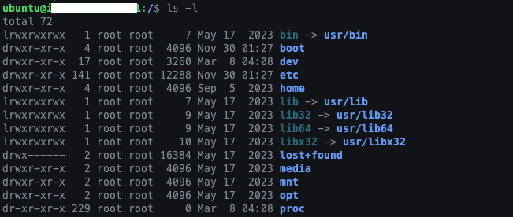
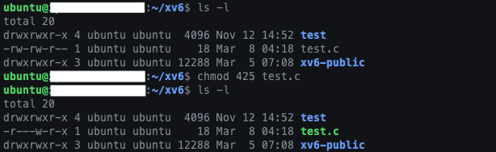
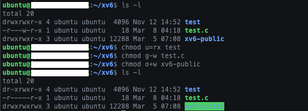

# [Week 01] 파일 입출력

> [!note]  
> 이 글은 숭실대학교 컴퓨터학부 홍지만 교수님의 2024년 1학기 리눅스시스템프로그래밍 수업을 듣고, 스스로 정리한 글입니다.

Linux/Unix에서는 키보드에서 데이터를 입력하고 터미널로 데이터를 출력하는 것을 포함하여 데이터를 입력 및 출력하는 모든 대상을 파일이라고 한다. 즉, 파일이란 **데이터를 읽을 수 있거나 쓸 수 있는 모든 객체**를 말한다. Linux/Unix에서는 파일을 **바이트 단위의 순차적인 스트림[^1]으로 처리**한다. 이는 사용자 프로그램, 일반 파일(정규 파일), 디렉토리 파일, 특수 파일 등으로 구분할 수 있다.

[^1]: 입출력 데이터를 일관된 방식으로 처리하기 위해 추상화된 개념으로 프로그램을 드나드는 데이터를 바이트의 흐름으로 표현한 단어

 

- [저수준 파일 입출력](#저수준-파일-입출력)
- [파일 디스크립터](#파일-디스크립터file-descriptor)
- [파일 실행 권한](#파일-실행-권한permission)

  

### 저수준 파일 입출력

파일을 다룰 때 커널에서 제공하는 `시스템콜`을 호출하는 방법

- 고수준 파일 입출력[^2]보다 좀 더 빠르게 파일을 다룰 수 있음
- byte 단위로 파일을 다루기 때문에 일반 파일 뿐만 아니라 특수 파일[^3]도 다를 수 있음
- 파일에 대한 직접적인 제어를 하기 때문에 때에 따라 고수준 파일 입출력을 사용하는 것이 편리하고 안전할 수 있음
- Linux/Unix에서는 파일에 접근할 때 기본적으로 파일 디스크립터(file descriptor)를 사용함

[^2]: `fopen()`, `fclose()`와 같이 라이브러리에서 제공되는 함수를 호출하여 파일을 다루는 방법  
[^3]: 데이터 전송 및 디바이스 접근 등에 사용되는 파일

  

### 파일 디스크립터(File Descriptor)

파일 디스크립터란 **파일에 접근하기 위한 식별자로 사용되는 음이 아닌 정수 값**이다. 이는 파일을 시스템 프로그래밍 차원에서 바이트 단위의 입출력으로 다룰 수 있도록 해주고, 커널 내부의 자료구조들과의 연결 통로 역할을 한다. 파일 디스크립터는 프로세스를 생성하거나 파일을 오픈하는 등의 상황에서 생성되며, 프로세스 실행 시 `표준 입력(0)`, `표준 출력(1)`, `표준 에러(2)`를 위한 파일 디스크립터는 내부적으로 생성된다. 또한 <unistd.h>에서 정의한 바와 같이 파일 디스크립터 0, 1, 2는 `STDIN_FILENO`, `STDOUT_FILENO`, `STDERR_FILENO` 등 심볼릭 상수를 사용하여 표현할 수 있다.

이러한 파일 디스크립터를 위한 자료구조를 `파일 디스크립터 테이블(FDT, File Descriptor Table)`이라고 부른다. 이는 프로세스가 현재 사용 중인 파일을 관리하기 위해 사용하는 테이블로 각 프로세스마다 하나씩 가지고 있다. 파일 디스크립터 테이블은 파일 테이블(file struct)[^4]을 가리키는 포인터를 담고 있는 배열이고, 이 배열의 인덱스가 바로 파일 디스크립터이다. 즉, **파일 디스크립터는 파일 디스크립터 테이블의 인덱스**이다. 따라서 파일에 접근한다는 것은 파일 디스크립터 테이블이라는 배열에서 파일 디스크립터라는 인덱스에 해당하는 원소가 가리키는 파일 테이블이 참조하는 i-node[^5]와 연결하여 데이터를 읽거나 쓰는 것을 의미한다. 이 때 프로세스는 테이블들의 정보를 직접 고칠 수 없으며, 반드시 `커널(kernel)`을 통해서 수정해야 한다.

[^4]: 열려있는 파일에 대한 정보를 저장하는 자료구조로 파일 디스크립터 테이블에서 파일 디스크립터와 일대일로 대응됨  
[^5]: 파일의 메타데이터를 저장하는 데이터 구조

  

### 파일 권한(Permission)

Linux/Unix는 **멀티 유저(Multi-User)[^6]를 강력하게 지원하는 운영체제**이다. 멀티 유저를 지원하는 환경에서는 개인정보 보호, 자원 공유 및 분리, 보안 강화, 운영체계 관리 등의 여러 사용자 간의 원활한 협업과 시스템 운영의 안전성 보장을 위한 기능이 중시된다. 이 때 사용되는 특별한 기능이 바로 `권한(permission)`이다. 사용자들은 자신에게 부여된 권한에 따라 파일을 읽고, 쓰고, 실행할 수 있으며, 각 파일의 소유자도 확인할 수 있다. 아래와 같이 파일 목록에서 각 파일의 권한을 확인할 수 있다. 

 

파일 목록에서 파일 유형, 파일 권한, 링크수, 소유자, 소유 그룹, 파일 크기, 마지막 수정 날짜, 파일명을 확인할 수 있다. 아래는 proc 파일 정보이다. proc는 디렉토리이고 파일 소유자, 파일 소유 그룹, 다른 사용자에게 읽고 실행할 권리를 부여했다. 해당 파일은 299번 링크되었으며, 소유자 및 소유 그룹은 모두 root이다. 또한 파일의 크기는 0 byte이고, 5월 8일 4시 8분에 최종 수정되었다.

 

파일 목록에서 각 줄의 맨 앞 1글자는 파일의 유형을 나타내고, 그 다음 9글자는 파일의 권한을 나타낸다. 이 때 파일에 접근해서 읽거나 쓰거나 실행할 권한은 `파일소유자(user)/파일소유그룹(group)/다른사용자(other)`로 나누어서 관리되며, 각각 3 bit(8진수)로 나타낼 수 있다. (ex. rwx rwx r-- = 111 111 100 = 0774)

- 파일 유형
    - `-`: normal file
    - `d`: directory
    - `l`: symbolic link file
    - `p`: named pipe
    - `s`: socket
    - `c`: character device
    - `b`: block device

- **권한(허가권)**: 
    - `-`: 읽기, 쓰기, 실행에 대한 권한이 없음
    - `r`  
        : 파일 → 파일에 대한 읽기 권한  
        : 디렉토리 → 디렉토리 내 파일을 나열할 수 있는 권한(ex.`ls`)
    - `w`  
        : 파일 → 파일에 대한 쓰기 권한  
        : 디렉토리 → 디렉토리 내의 파일 생성, 삭제, 이름 변경 등과 관련된 권한
    - `x`  
        : 파일 → 파일에 대한 실행 권한  
        : 디렉토리 → 작업 디렉토리 변경 등의 디렉토리 간 이동과 관련된 권한으로, **디렉토리는 실행 권한 x를 꼭 가지고 있어야 해당 디렉토리로 이동할 수 있음**

 

권한을 변경하기 위해서는 `chmod` 명령어를 사용한다. 이는 **숫자 코드**를 사용하는 방법과 **기호 문자**를 사용하는 방법이 있다.

- `chmod [숫자 코드] [파일]`

    - 8진수를 이용하여 사용자, 그룹, 다른 사용자에게 권한 부여
    - 읽기(4), 쓰기(2), 실행(1), 권한 없음(0)

        

- `chmod [기호 문자] [파일]`

    - 대상: 사용자(u), 그룹(g), 다른 사용자(o), 모두(ugo, a)
    - 권한: 부여(+), 삭제(-), 설정(=)
    - 종류: 읽기(r), 쓰기(w), 실행(x)

        

[^6]: 여러 사용자가 동시에 하나의 시스템에 접근하는 것